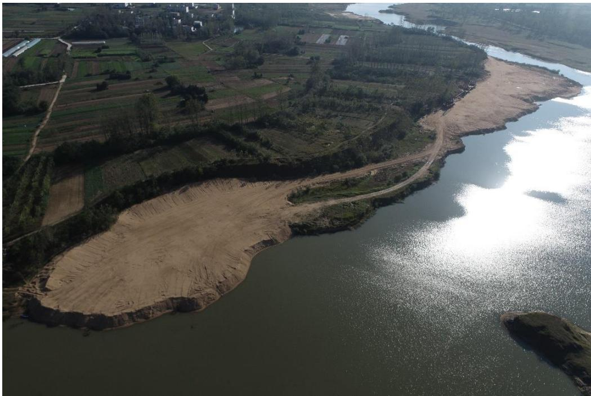
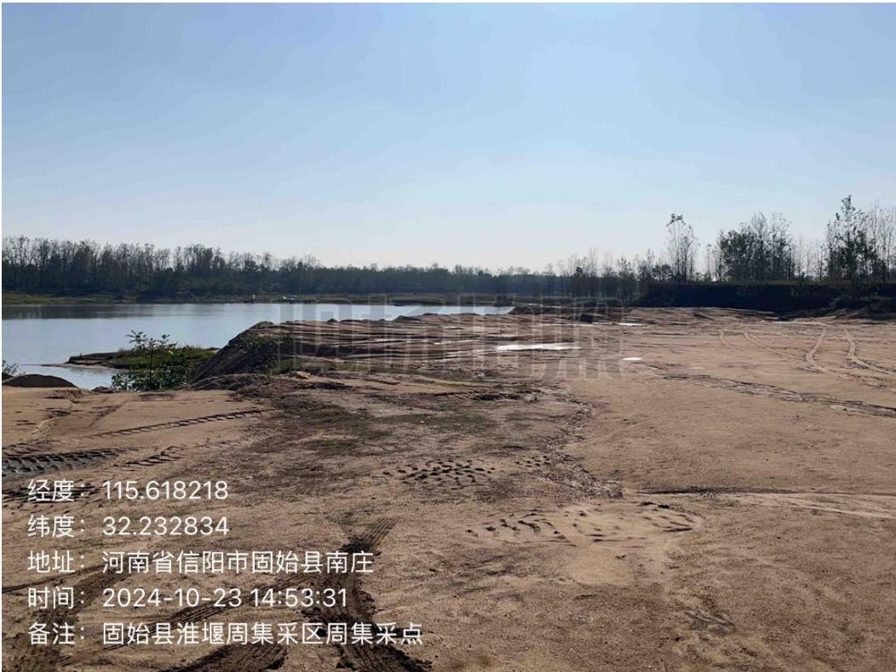
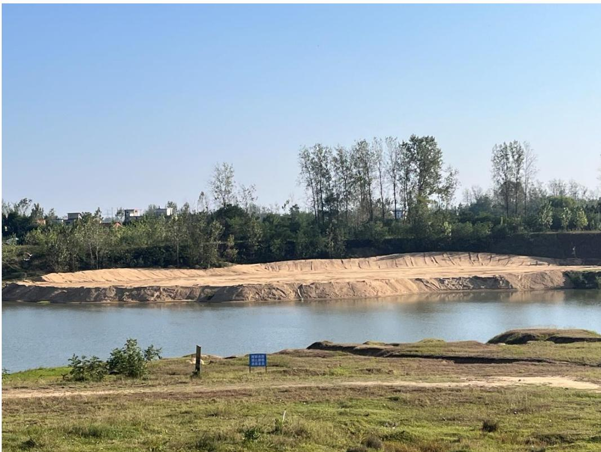
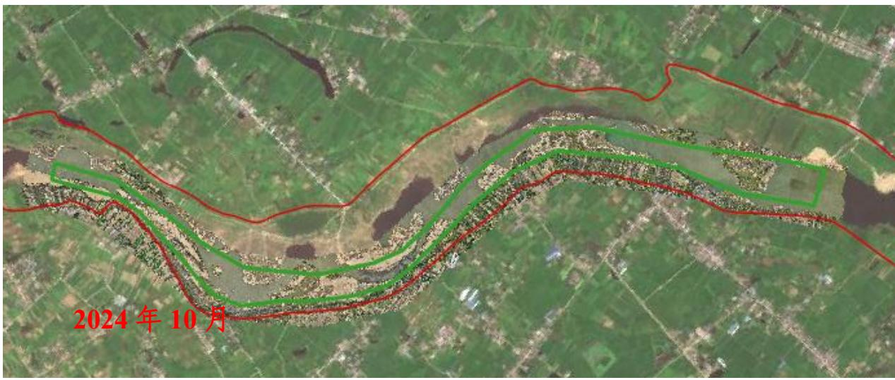
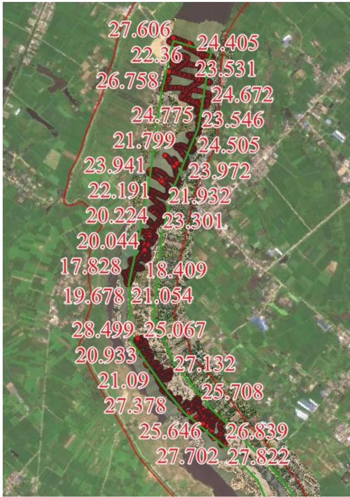
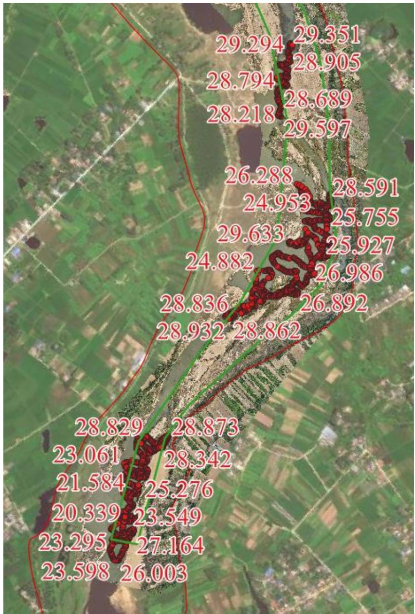
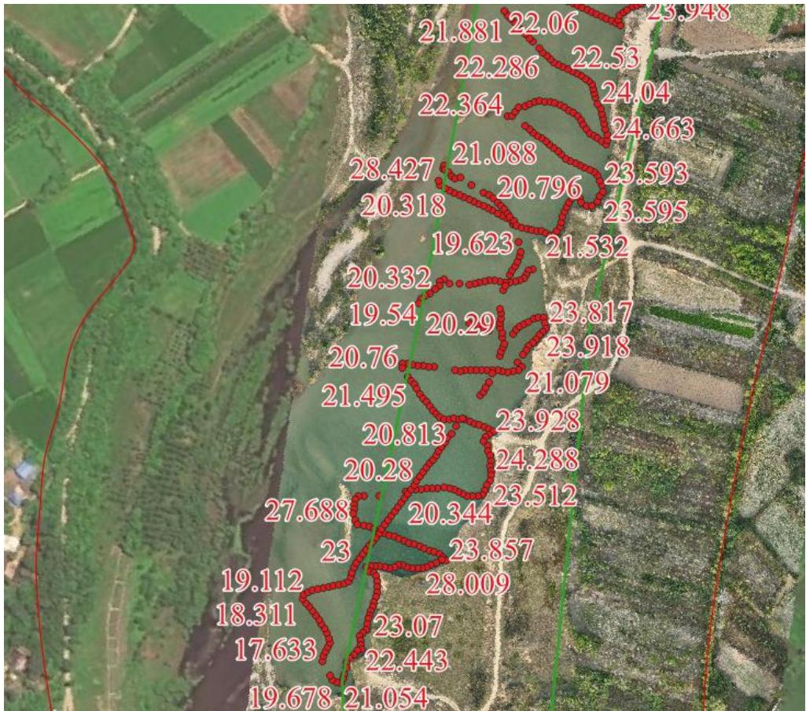

（1）现场监测 通过实地查看，淮堰和周集两处采点现场临时堆砂均已完成转运，场地平整修复基本到位。  图 5.6-60 淮堰采点现场照片  图 5.6-61 周集采点现场照片  图 5.6-62 淮堰采点提砂码头已平复 # （2）无人机航测 采砂监管测量人员对固始县淮堰-周集采区进行了无人机航空摄影测 量，经评估分析，未发现超范围开采情况，生态修复良好。  图 5.6-63 固始县淮堰-周集采区无人机正射影像 # （3）无人船水下测量 根据批复文件和2023年度实施方案，开采后控制高程为28.30-29.30m，通过无人船单波束声呐测量采区水下地形，测量成果显示采区上、下游采点采后平均河底高程均低于开采控制高程，开采深度不满足年度实施方案要求，平均超采深度为 4 米左右。  图 5.6-64 固始县淮堰-周集采区上游无人船水下测量成果  图 5.6-65固始县淮堰-周集采区下游无人船水下测量成果  图 5.6-66固始县淮堰-周集采区超深度开采区域局部放大
