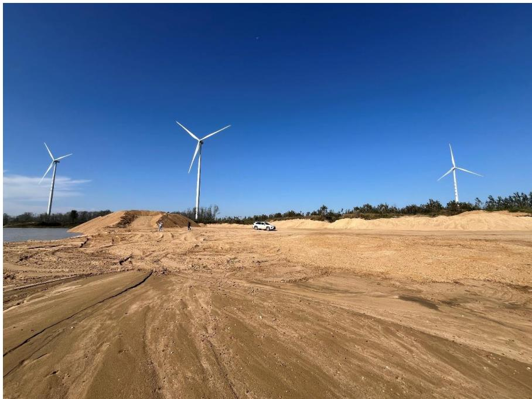
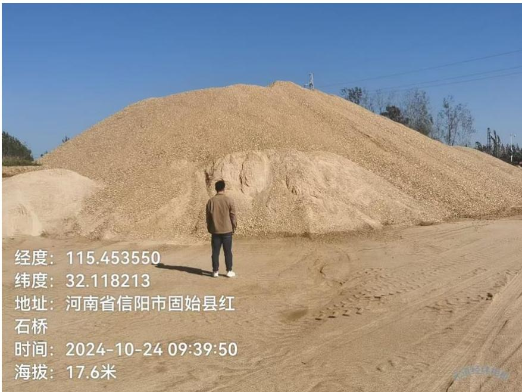
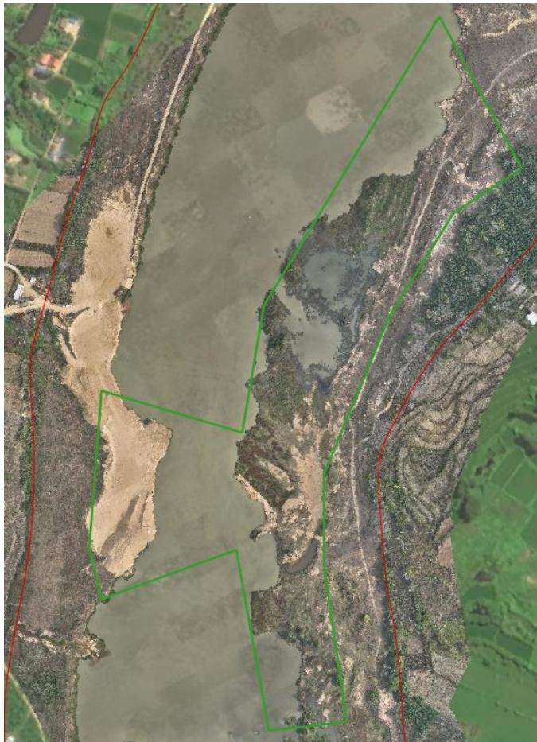
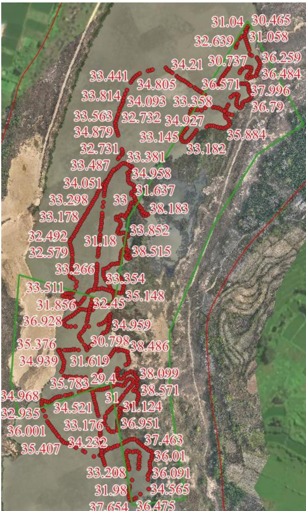

（1）现场监测 通过实地查看，临时堆砂场基本平整修复到位，临时堆砂场内堆放有两处河石，体量较大，堆放高度超高，一处堆砂紧邻河道。  图 5.6-67 采区现场照片  图 5.6-68 采区堆砂未清运 # （2）无人机航测 采砂监管测量人员对固始县叶岗采区 GH4 可采区进行了无人机航空摄影测量，经评估分析，未发现超范围开采情况，废弃料砂堆堆砌在河岸 左侧码头，现场坑洼不平生态修复不到位。  图 5.6-69 固始县叶岗采区 GH4 可采区无人机正射影像 # （3）无人船水下测量 根据批复文件和2023年度实施方案，开采后控制高程为33.5-33.75m，通过无人船单波束声呐测量采区水下地形，测量成果显示采区采后平均河底高程高于开采控制高程，开采深度基本符合年度实施方案要求。叶岗采区 GH4 可采区河道上游提砂作业区修复不到位，需进一步加强管理。  图 5.6-70 固始县叶岗采区 GH4 可采区无人船水下测量成果
