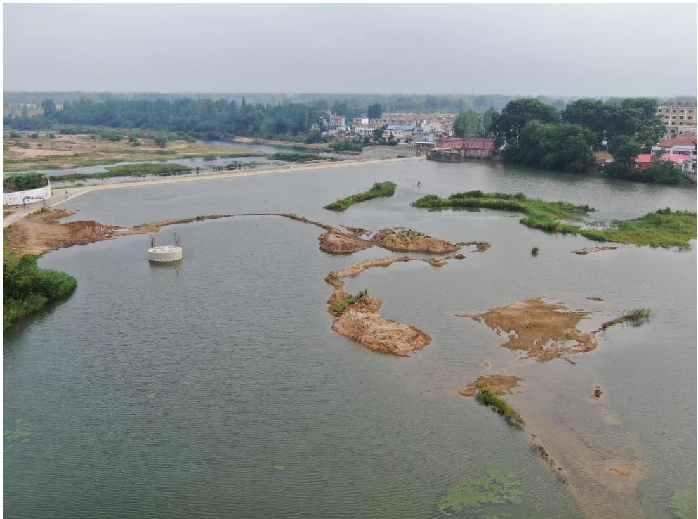
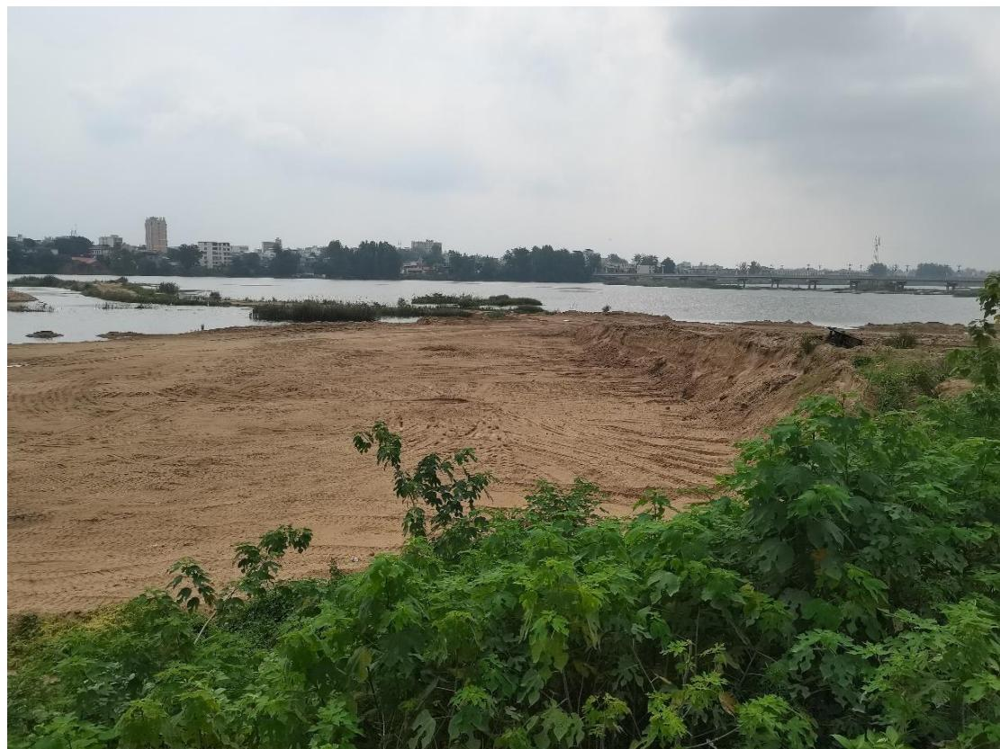
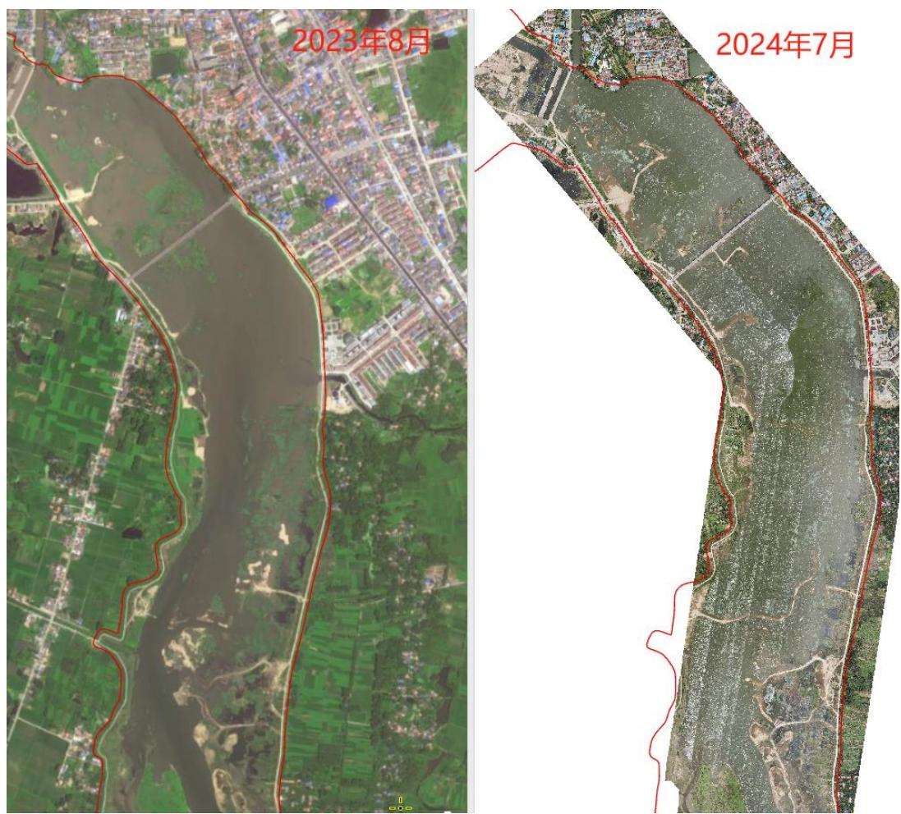
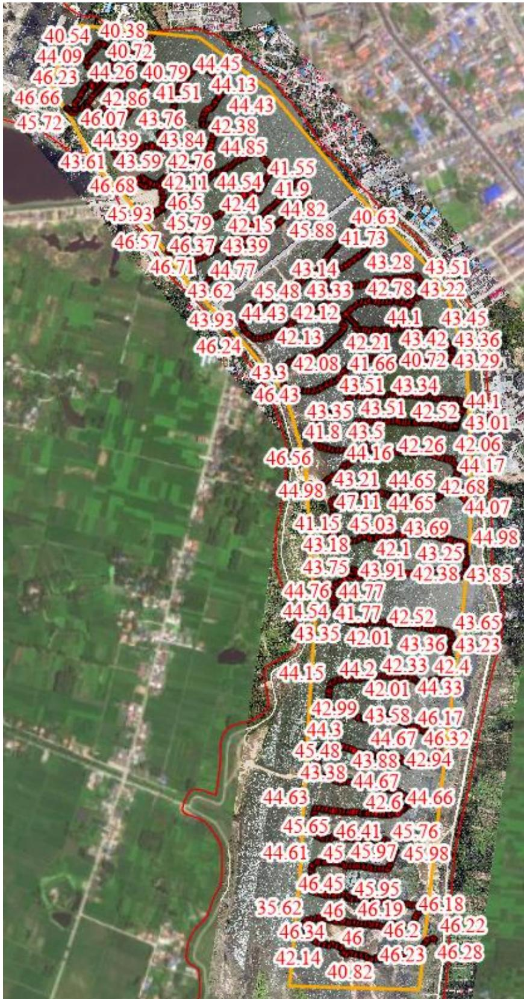
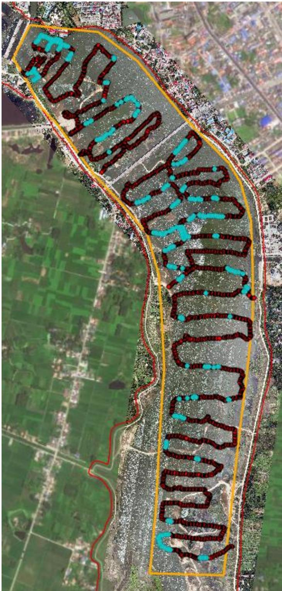
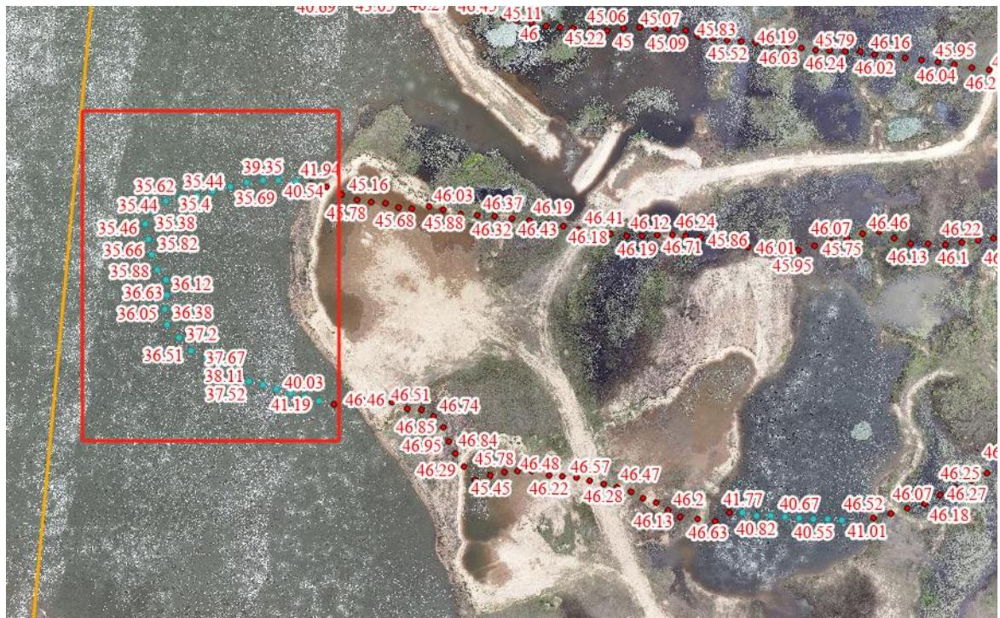

（1）现场监测 通过实地查看，现场水位较高，整体情况较前期有了较大改善，后期应进一步处理主河槽内凸起砂包。  图 5.6-71 工程区下游主河槽内凸起的砂包  图 5.6-72 工程现场照片 # （2）无人机航测 采砂监管测量人员对固始县黎集滚水坝上游清淤扩容工程河道疏浚区域进行了无人机航空摄影测量，经评估分析，未发现超范围开采情况，主河槽内多处凸起砂包，后期施工过程中应加强对该问题的处理，生态修复有待进一步提升。  图 5.6-73 固始县史灌河马埠 SGH7 可采区无人机正射影像 # （3）无人船水下测量 根据《固始县黎集滚水坝上游清淤扩容工程砂石处置方案》，河道清淤底高程 42.0m ，通过无人船单波束声呐测量采区水下地形，测量成果显示该采区部分区域水下高程低于清淤底高程，其中采区上游局部区域超深6 米左右。  图 5.6-74 固始县黎集滚水坝上游疏浚工程无人船水下测量成果  图 5.6-75 河底高程低于 42m 点位分布  图 5.6-76 采区上游局部超深点位分布（红框区域）
