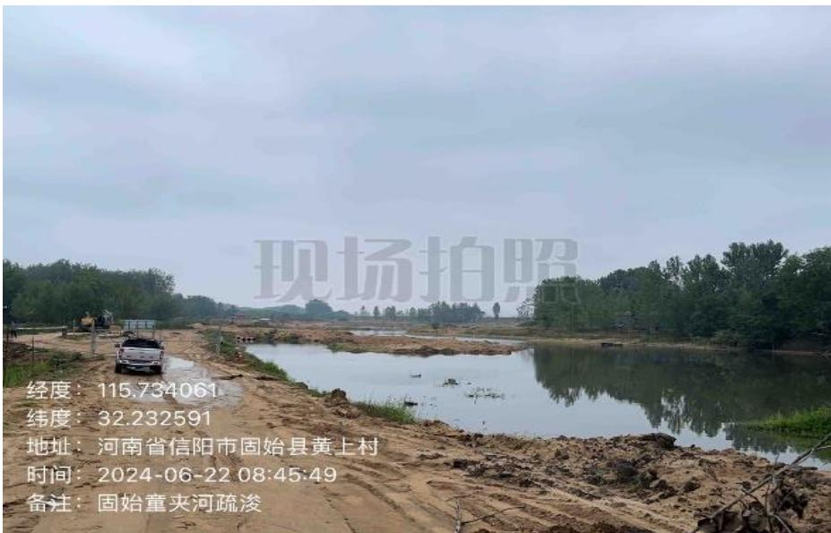
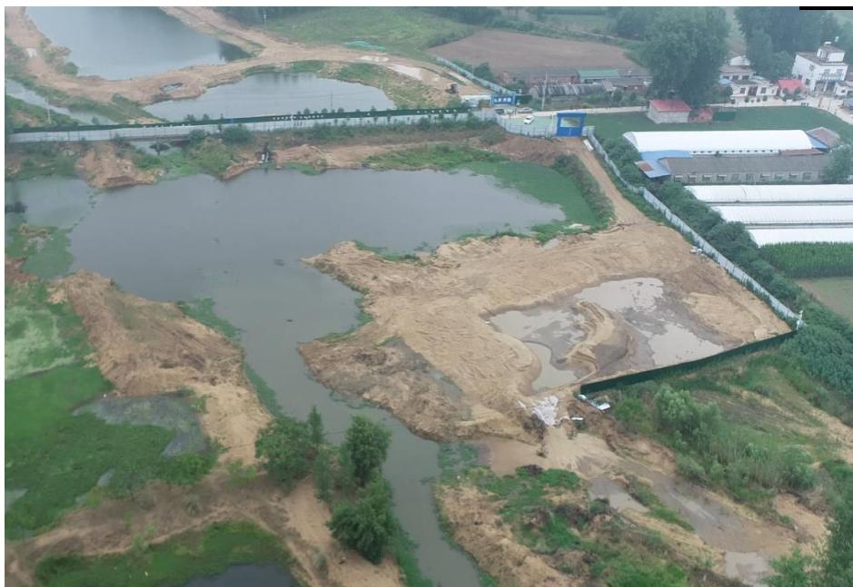
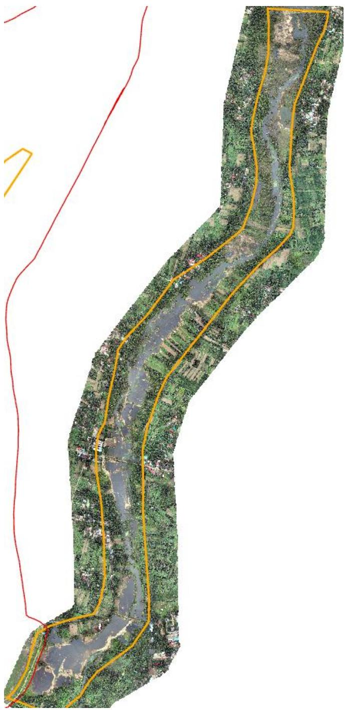

（1）现场监测 通过现场实地查看，工程只在上游部分区域实施，目前处于暂停状态。夹河村河段存在两处养殖场污水直排，一处养鸡场一处养牛场。考虑到该工程作业时间较短，疏浚范围较小且现场水位较浅，本次监测未进行无人船水下高程测量。  图 5.6-77 工程上游现场监管照片  图 5.6-78 疏浚工程区中游现场照片（无人机） # （2）无人机航测 采砂监管测量人员对固始县史河故道（夹河）区域综合整治工程河道疏浚区域进行了无人机航空摄影测量，叠加砂石处置方案批复范围（桩号$\mathrm { K } 0 \mathrm { + } 0 0 0 \mathrm ~ \mathrm { K } 1 0 \mathrm { + } 5 3 1$ ）进行评估分析，未发现超范围开采情况，实际施工区域不大，主要位于上游和中游的两块区域。  图 5.6-79 固始县夹河疏浚工程无人机正射影像
