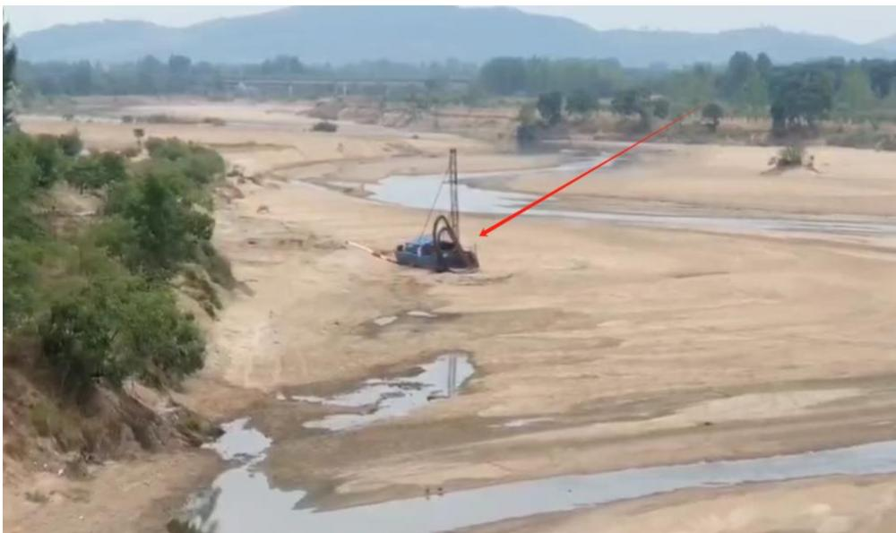
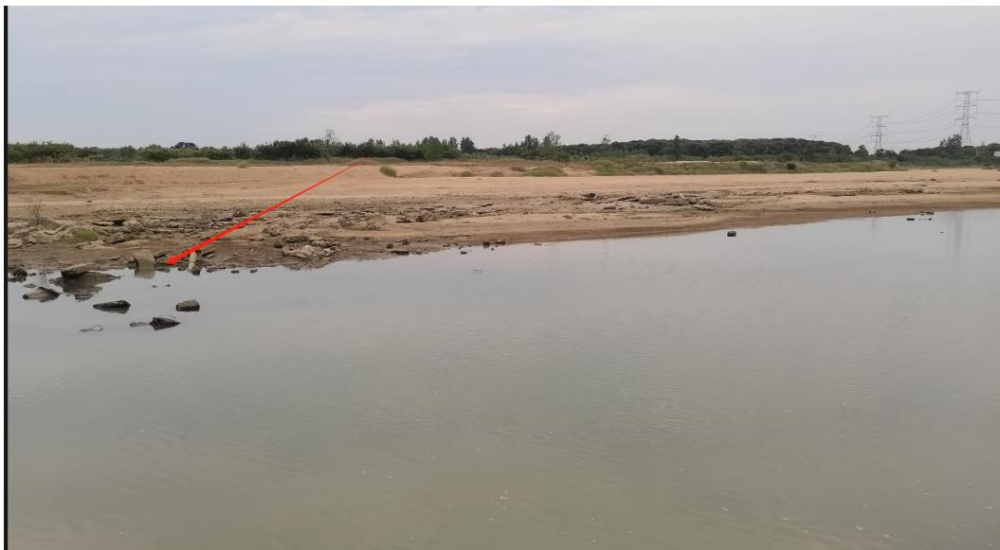
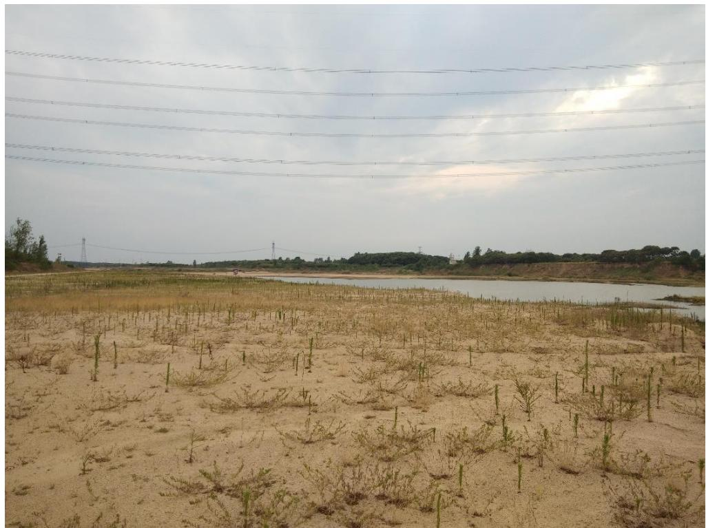
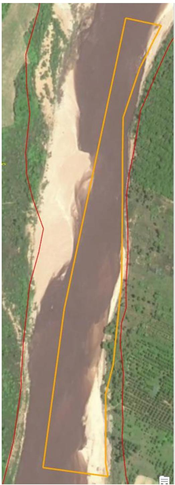
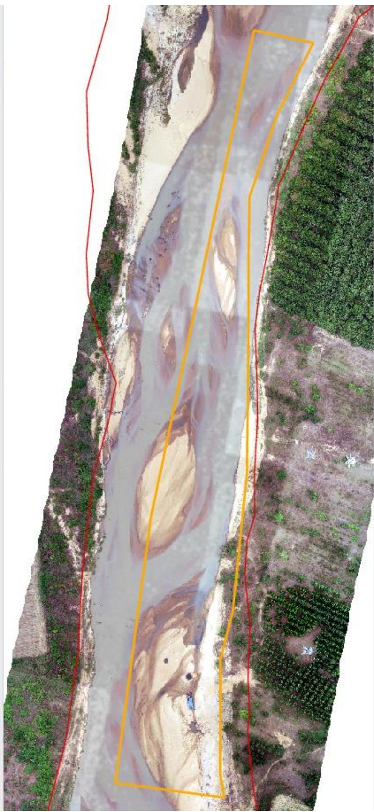
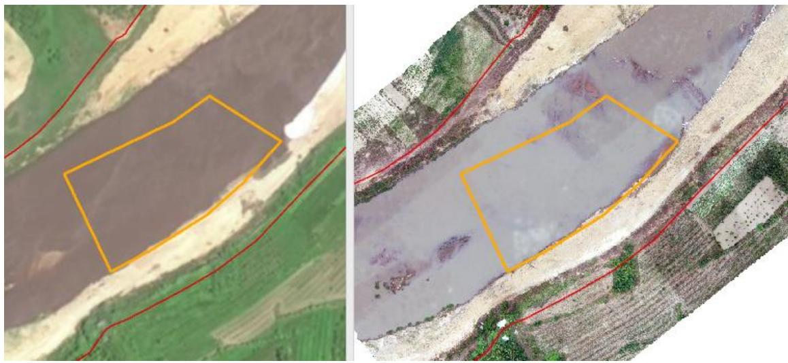
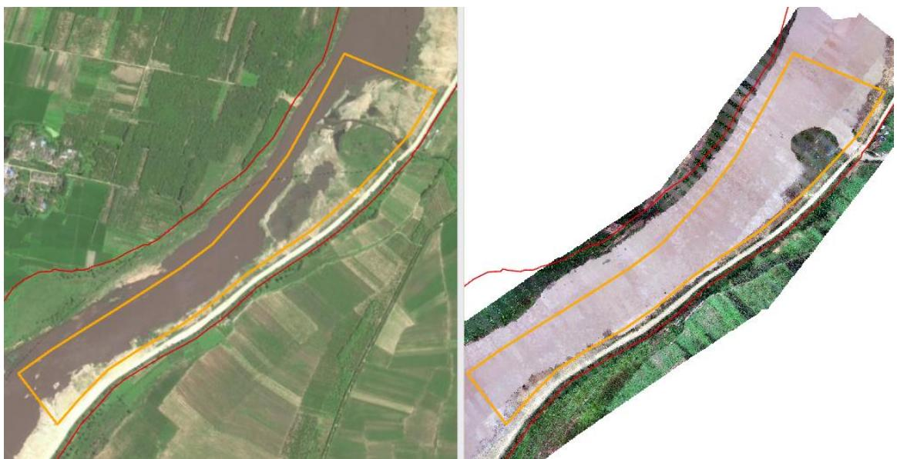
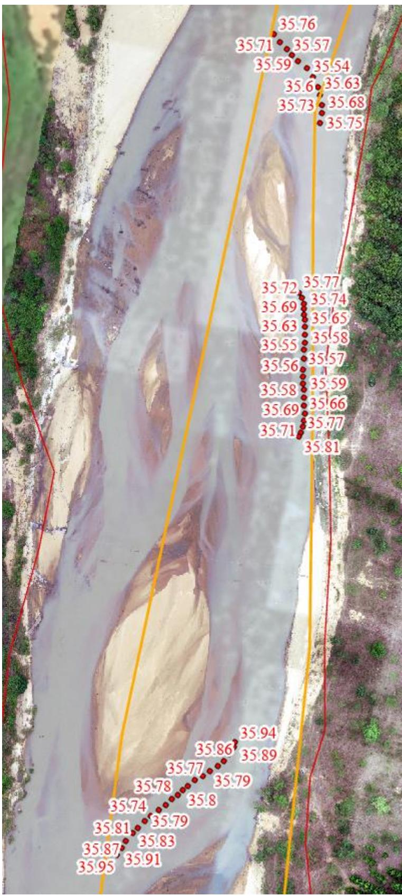
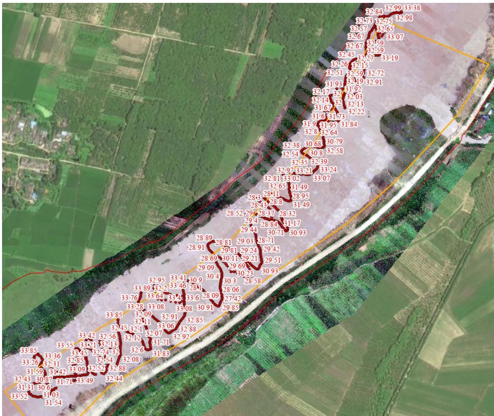

（1）现场监测 通过现场实地查看，息县竹竿河景美店村采区和陈大洼采区临时堆砂点已完成平复，边界识别牌过期需要及时移除、河道内存在建筑垃圾，采区现场无坑洼不平，生态修复基本到位。开采结束后绝大部分船只机具已撤离至河道管理范围线外，景美店采区上游河道内存在一艘废弃采砂船未拖离上岸。   图 5.7-1 息县竹竿河景美店村采区上游河道内采砂船（无人机） 图 5.7-2 息县竹竿河陈大洼采区河道内建筑垃圾  图 5.7-3 息县竹竿河陈大洼村采区现场 # （2）无人机航测 采砂监管测量人员对豫息砂许〔2023〕第 01 号批复采砂区域涉及的景美店村 1#、2#可采区和陈大洼村可采区分别进行了无人机航空摄影测量，叠加 2023 年度规划批复范围（景美店村 1#开采区桩号 ${ \mathrm { K } } 0 \substack { + } 0 0 0 \sim$ ${ \mathrm { K 0 + 8 0 0 } }$ 、景美店村 2#开采区桩号 $\mathrm { K } 2 + 1 0 5 \sim \mathrm { K } 2 \substack { + 2 5 3 }$ 、陈大洼村开采区桩号 $\mathrm { K } 3 + 7 4 2 \sim \mathrm { K } 4 + 9 4 2$ ）进行评估分析，未发现超范围开采情况，采区生态修复基本到位。   （a）竹竿河景美店村 1#可采区  （a）竹竿河景美店村 2#可采区  图 5.7-4 息县竹竿河景美店村可采区无人机正射影像 图 5.7-5 息县竹竿河景陈大洼村可采区无人机正射影像 # （3）无人船水下测量 # 1）景美店村采区 根据批复文件和 2023 年度实施方案，景美店村采区开采后控制高程为 $3 4 . 6 0 \mathrm { m } { - 3 5 . 0 0 } \mathrm { m }$ （景美店村 1#采区）， $3 3 . 8 8 \mathrm { m } { - 3 3 . 9 5 } \mathrm { m }$ （景美店村 2#采区）。对于实际发生采砂活动的区域，通过无人船单波束声呐测量采区水下地形，测量成果显示，景美店村采区采后高程均位于 35m 以上，开采 深度符合年度实施方案要求。  图 5.7-6 息县景美店村采区无人船测量成果 # 2）陈大洼村采区 根据批复文件和 2023 年度实施方案，陈大洼村采区开采后控制高程为 $3 1 . 5 3 \mathrm { m } { - 3 2 . 1 3 } \mathrm { m }$ 。通过无人船单波束声呐测量采区水下地形，测量成果显示，陈大洼村采区局部区域采后高程低于开采控制最低高程，主要位于中部提砂区附近，存在提砂区域修复不到位问题。  图 5.7-7 息县陈大洼村采区无人船测量成果
