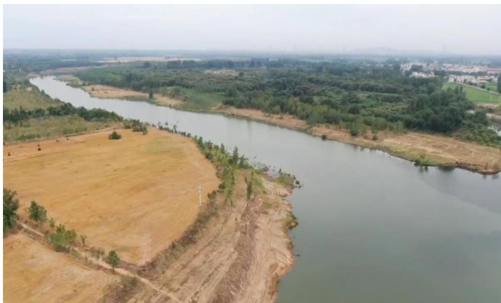
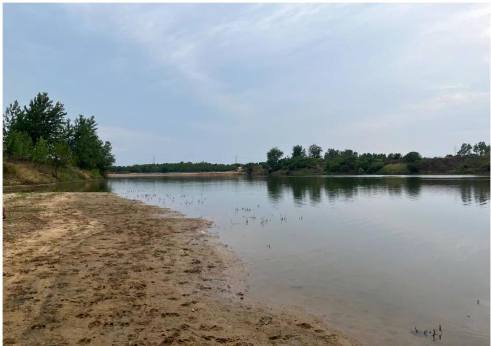
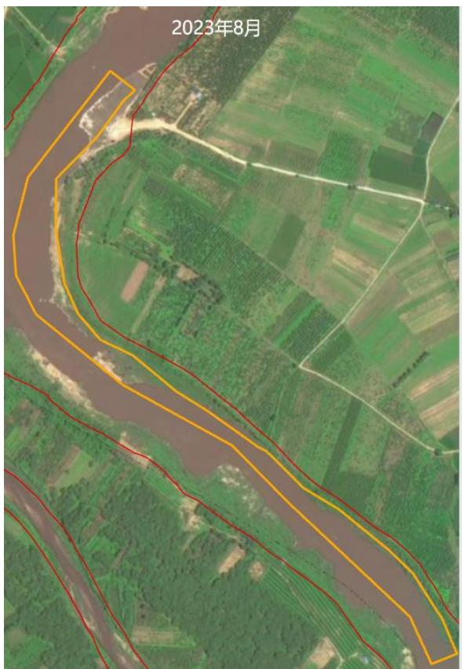
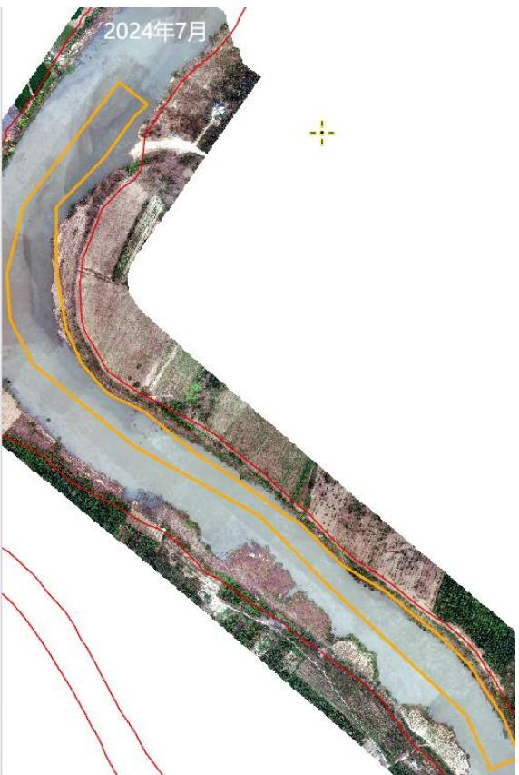
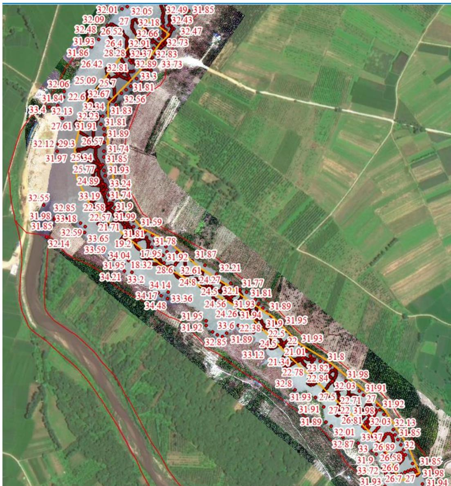
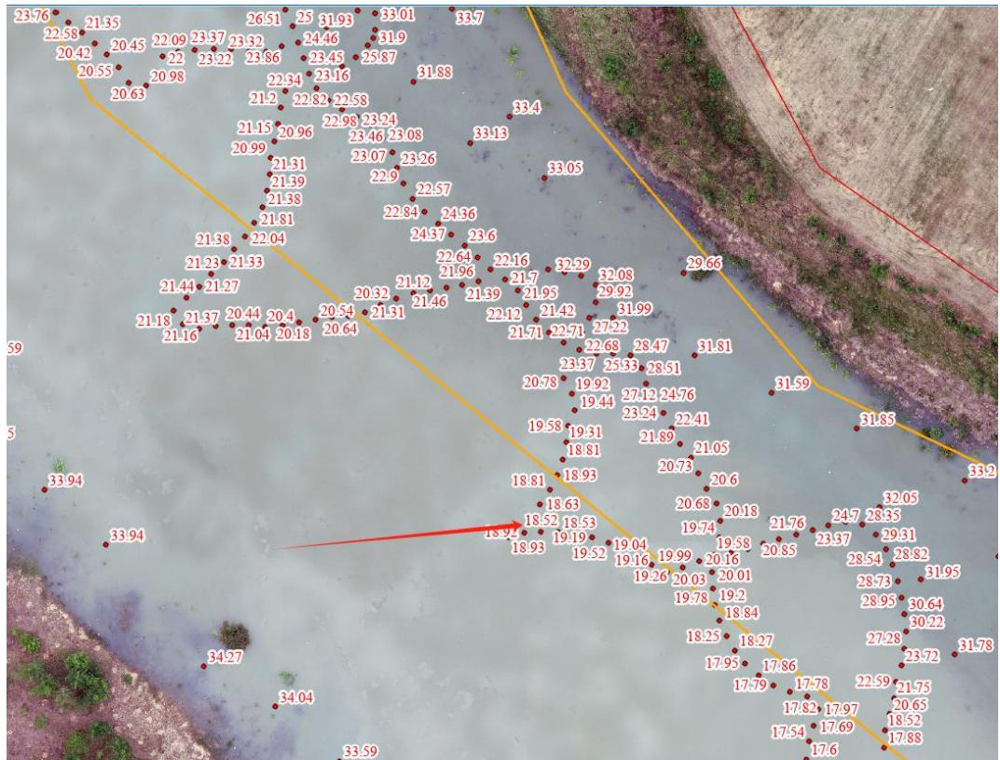

（1）现场监测 通过现场实地查看，息县竹竿河李家庄村可采区采砂活动主要位于水下，对采区河岸环境扰动较小，开采结束后船只机具已集中停靠，临时堆砂点现场平复到位，现场无坑洼不平，生态修复良好。  图 5.7-8 息县竹竿河李家庄村可采区（无人机）  图 5.7-9 息县竹竿河李家庄村可采区现场照片 # （2）无人机航测 采砂监管测量人员对豫息砂许〔2023〕第 02 号批复采砂区域涉及的李家庄村可采区进行了无人机航空摄影测量，叠加 2023 年度规划批复范围（桩号 $\mathrm { K } 9 + 1 7 6 \sim \mathrm { K } 1 0 { + } 8 7 6 \ $ ）进行评估分析，未发现超范围开采情况，采区生态修复基本到位。   图 5.7-10 息县竹竿河李家庄村可采区无人机正射影像 # （3）无人船水下测量 根据批复文件和 2023 年度实施方案，李家庄村采区开采后控制高程为 26.56m-27.41m。通过无人船单波束声呐测量采区水下地形，测量成果显示，李家庄村采区上、下游河段实测水底高程普遍在 26.56m 以上，开采深度满足批复要求；中游河段多块区域实测河床高程低于年度实施方案中的控制开采底高程，该区域内最低高程为 18.81m ，平均高程 22.90m ，超深约 $3 . 6 6 \mathrm { { m } }$ ，采区部分河段超深度开采。  图 5.7-11 息县李家庄村采区无人船测量成果  图 5.7-12 息县李家庄村采区局部超深区域测量成果
