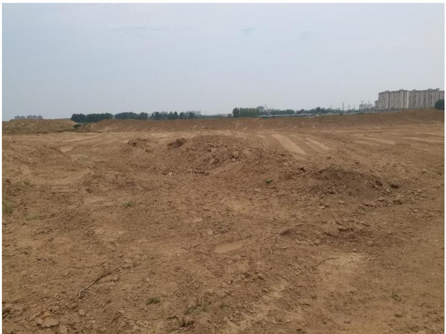
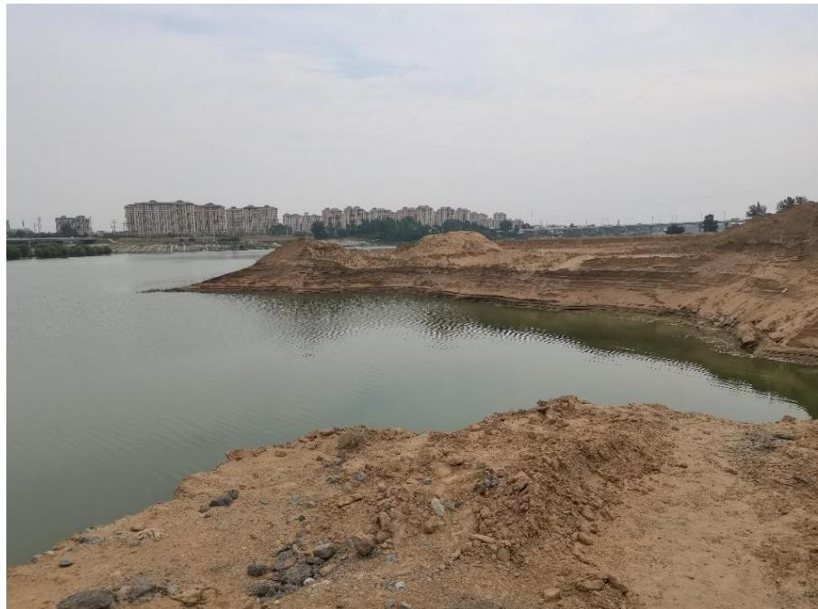
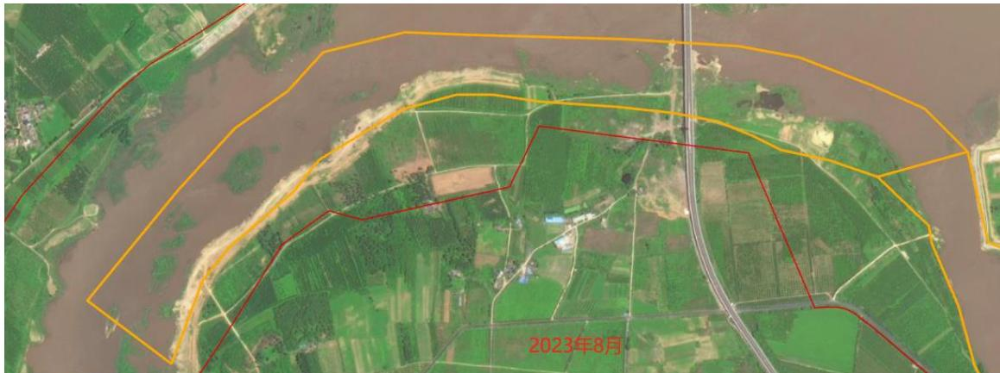
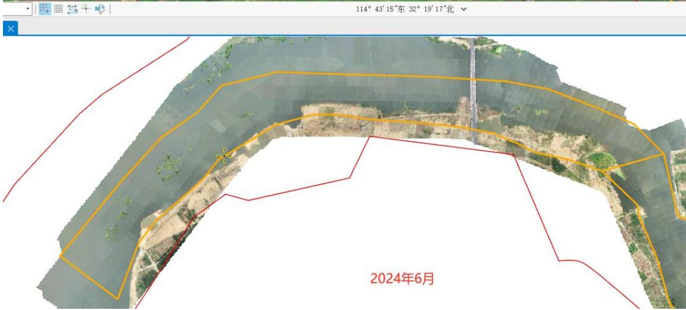

（1）现场监测 通过现场实地查看，工程现场已对照市水利局反馈意见进行了深度整改，制砂筛砂设备已清理出采区，船只已集中停靠，现场临时堆砂已开始转运至储砂场；储砂场六有设施基本完善。  图 5.7-13 疏浚工程现场照片  图 5.7-14 疏浚工程现场照片 # （2）无人机航测 采砂监管测量人员对淮河（竹竿河入淮口至桃花岛段）航道疏浚及岸线整治工程进行了无人机航空摄影测量，叠加年度砂石处置范围进行评估分析，未发现超范围开采情况，现场未见制砂设备，局部砂坑已经平复，工程区生态修复情况有所提升。   图 5.7-15 竹竿河入淮口至桃花岛航道疏浚工程无人机正射影像
