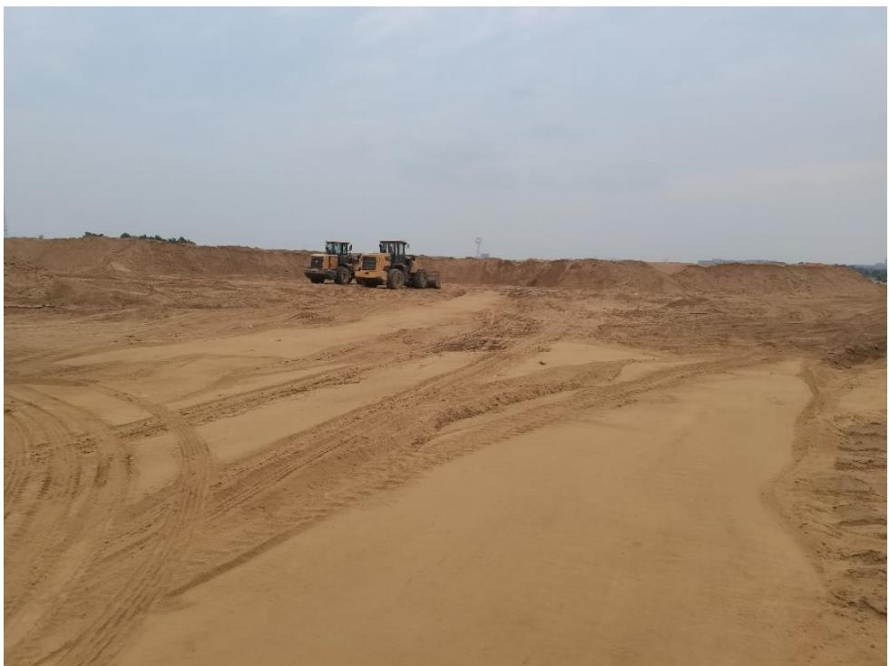
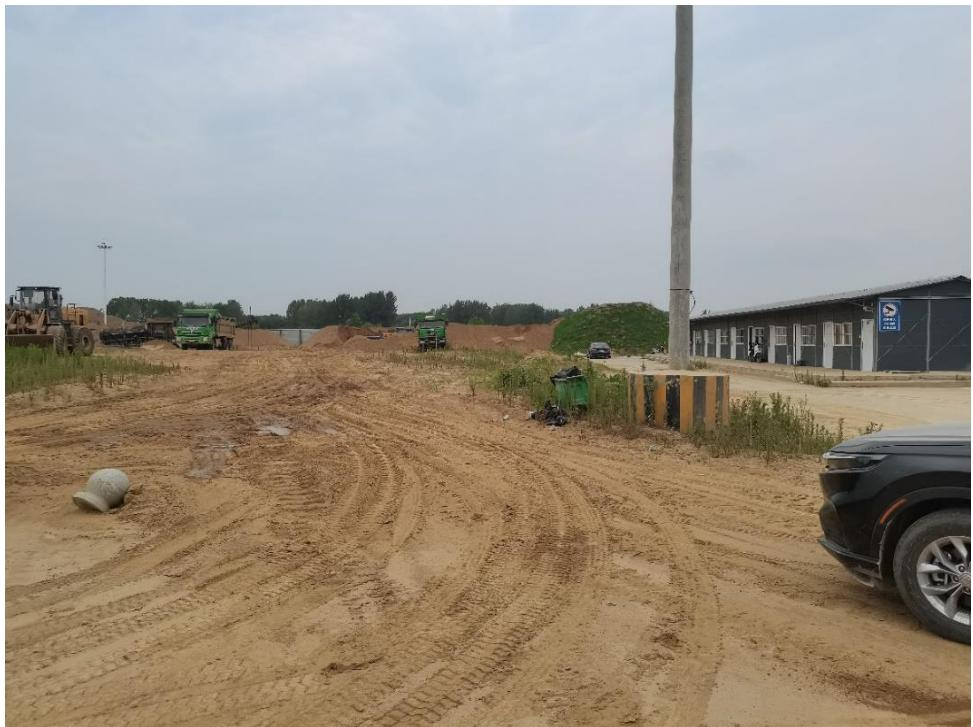
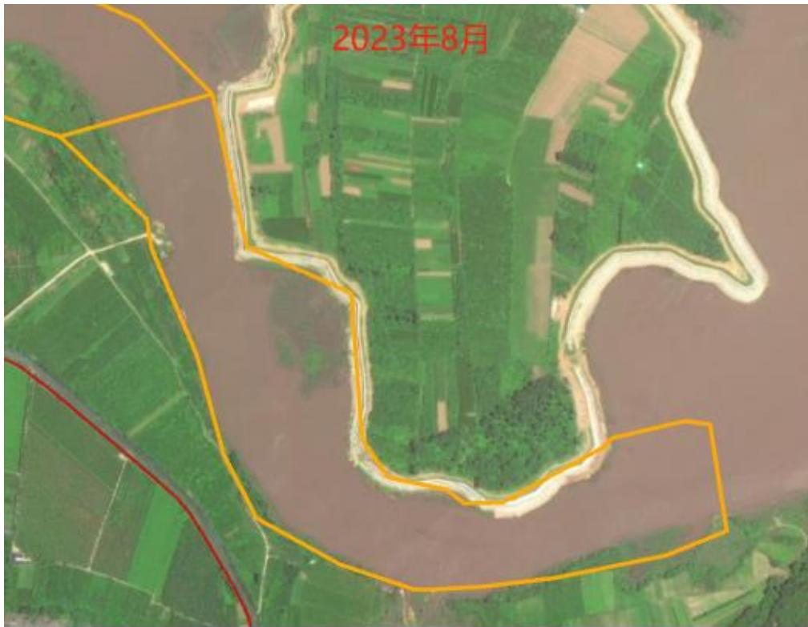
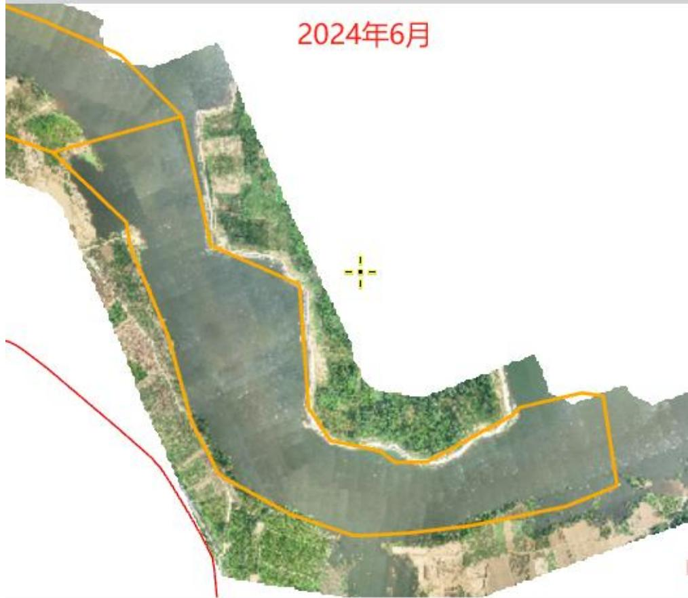
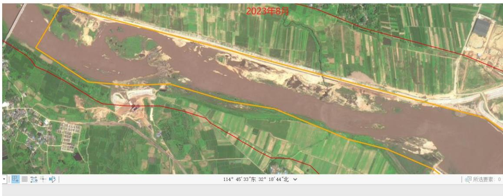
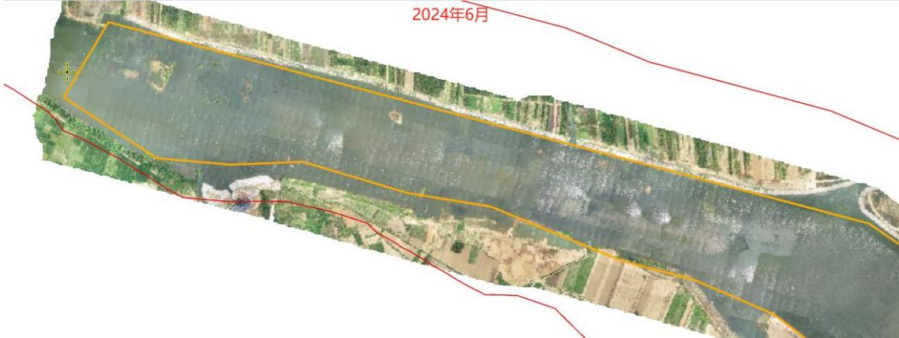
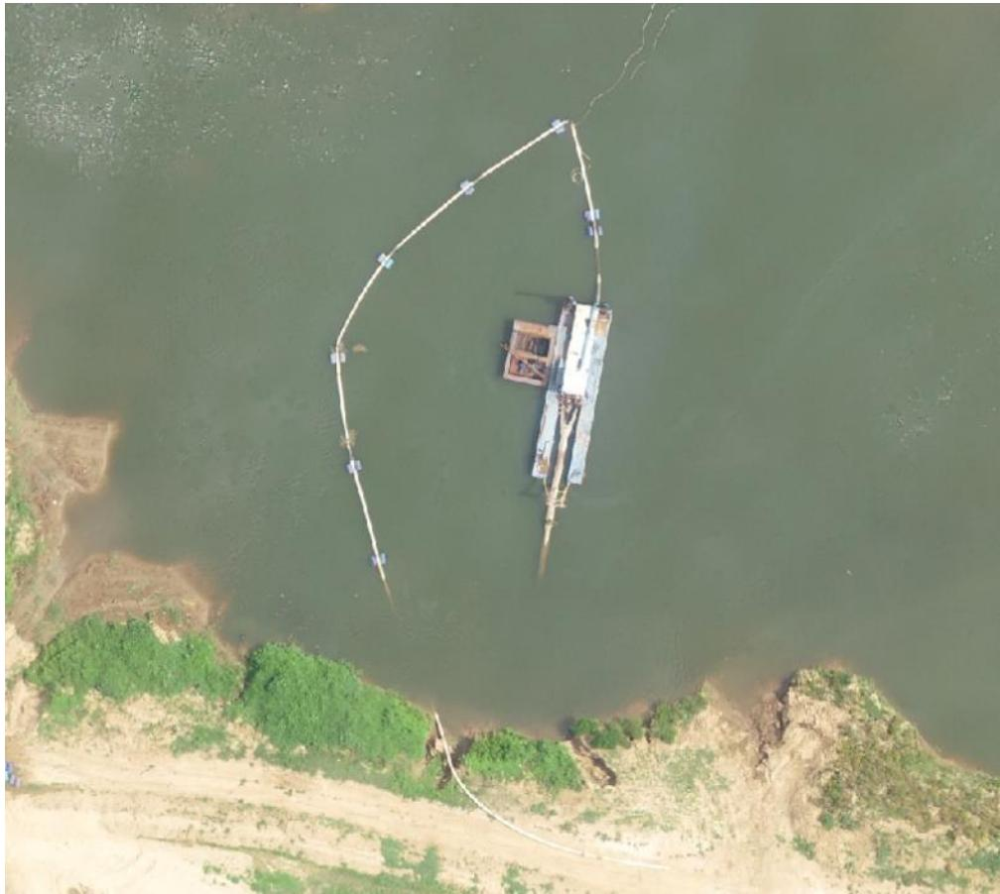

（1）现场监测 通过现场实地查看，息县淮河干流桃花岛至息县枢纽段河道整治工程工程区到储砂场道路已经畅通，临时堆砂多数已转运至储砂场，现场正在进行平复作业。  图 5.7-16 息县桃花岛至息县枢纽疏浚工程现场照片  图 5.7-17 息县桃花岛至息县枢纽疏浚工程储砂场 # （2）无人机航测 采砂监管测量人员对息县淮河干流桃花岛至息县枢纽段河道整治工程进行了无人机航空摄影测量，叠加年度砂石处置范围进行评估分析，未发现超范围开采情况，工程区右岸局部作业区坑洼不平，需进一步加强生态修复，下游采区中段右岸有一艘疏浚船只未靠岸停靠，疑似未锚固。  114°44'48″东32°196北  图 5.7-18 息县桃花岛至息县枢纽疏浚工程上游段无人机正射影像   图 5.7-19 息县桃花岛至息县枢纽疏浚工程下游段无人机正射影像  图 5.7-20 工程下游段中部区域右岸一艘疏浚船只未锚固
