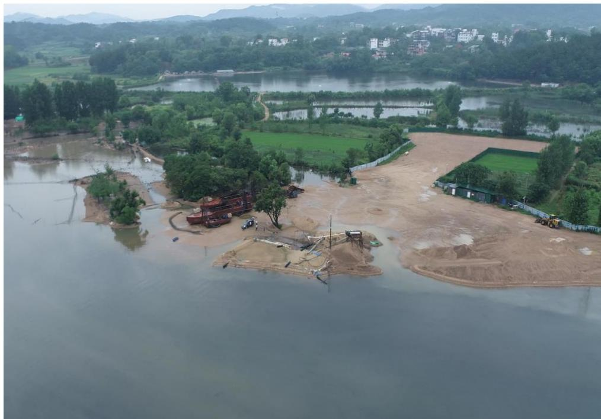
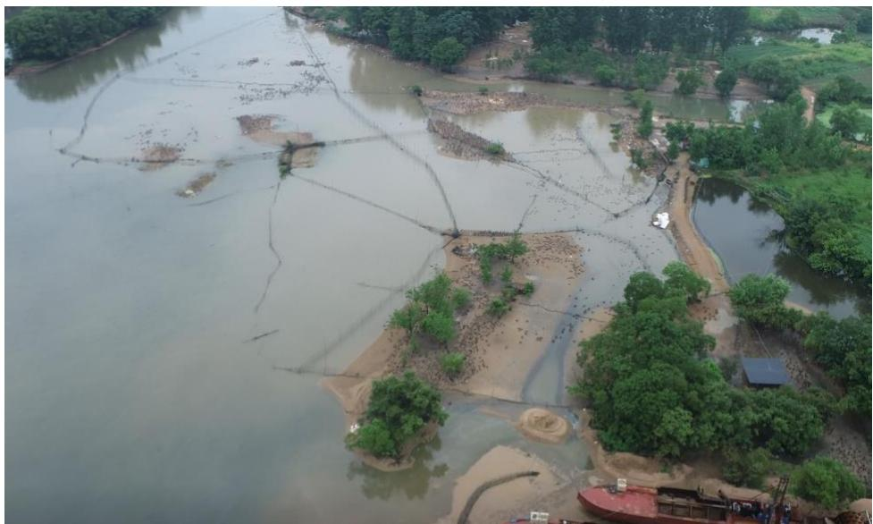
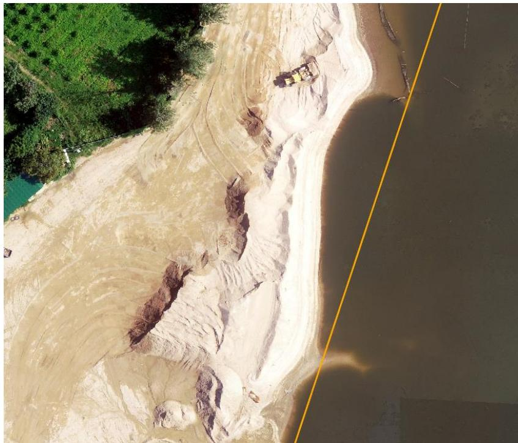
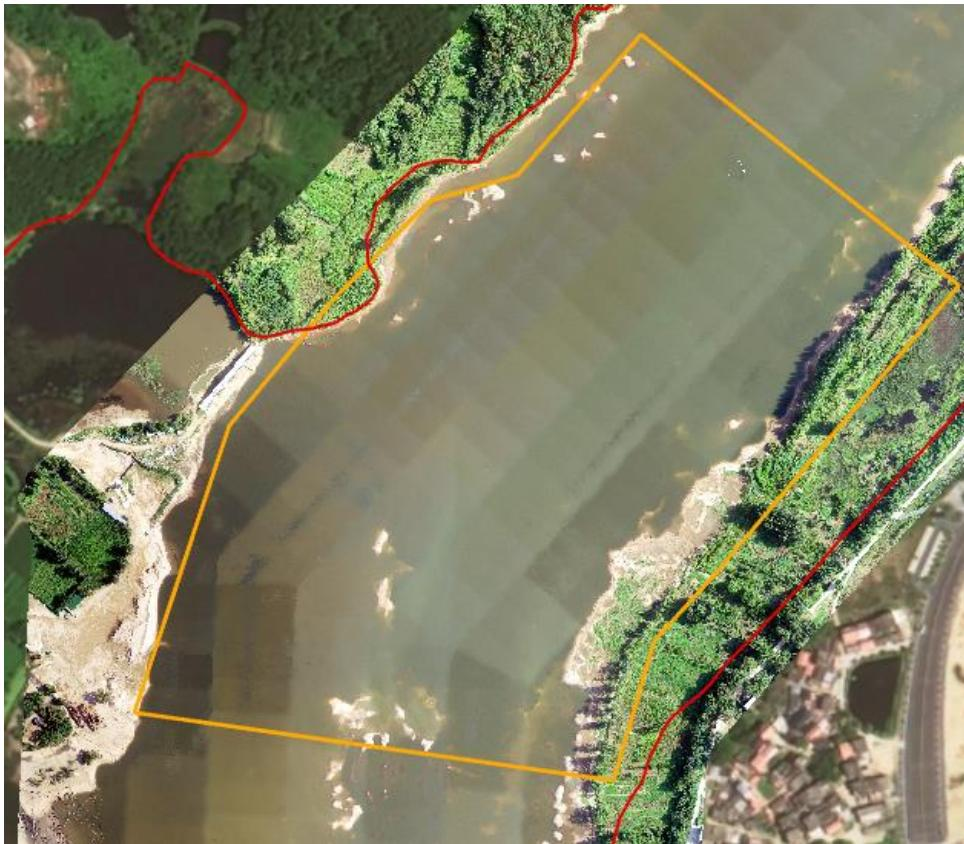
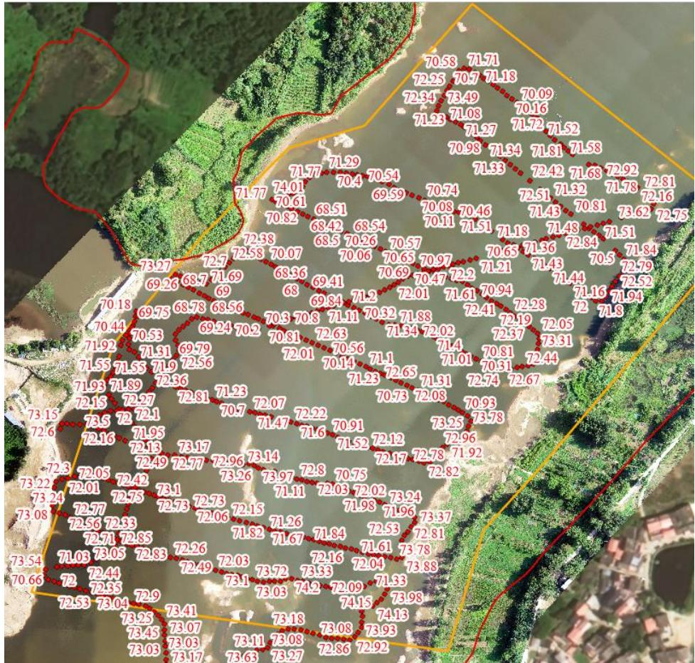

（1）现场监测 通过现场实地查看，商城县鲇鱼山水库坝下可采区提砂作业区临时砂堆未转运平复，作业机具未拖离河道管理范围线，现场无值班人员出入卡口未封闭，可以随意进出，上游河道内存在较大规模鸭子养殖，污染河道。  图 5.8-1 商城县坝下采区监测现场  图 5.8-2 商城县坝下采区上游河道内大规模鸭子养殖  图 5.8-3 坝下采区堆砂未转运至储砂场 # （2）无人机航测 采砂监管测量人员对豫信砂许〔2023〕第 01 号采砂区域进行了无人机航空摄影测量，叠加 2023 年度规划批复范围（桩号 $2 + 3 0 0 ~ 2 { + } 9 0 0$ ）进行评估分析，未发现超范围开采问题，开采区现场生态修复不到位。  图 5.8-4 商城县坝下可采区无人机正射影像 # （3）无人船水下测量 根据批复文件和 2023 年度实施方案，商城县鲇鱼山水库坝下可采区采后控制高程为 $7 0 . 9 ~ 7 1 . 1 \mathrm { m }$ 。通过无人船单波束声呐测量采区水下地形，测量成果显示局部采区深度略低于 70.9m ，主要位于提砂区附近，属于提砂区修复不到位。  图 5.8-5 商城县鲇鱼山水库坝下可采区无人船实测数据
