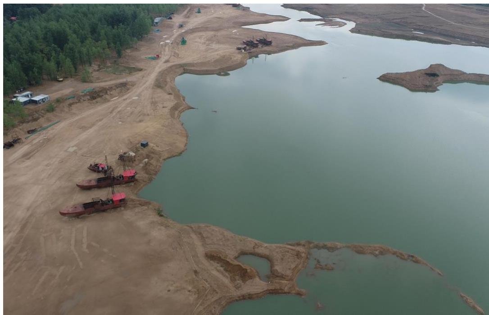
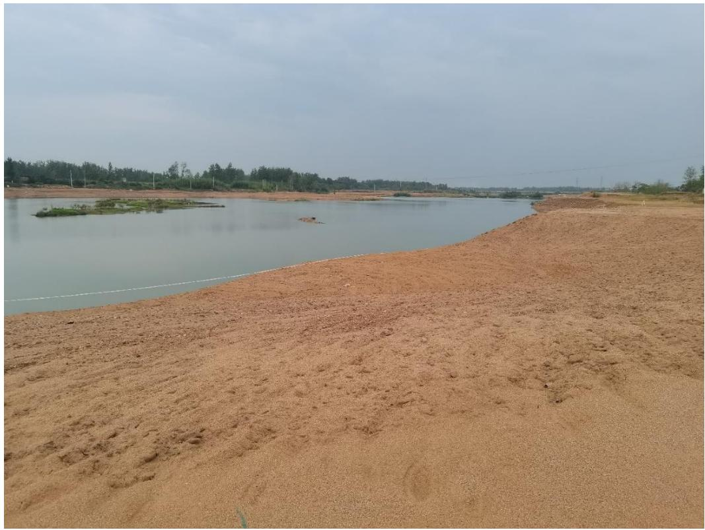
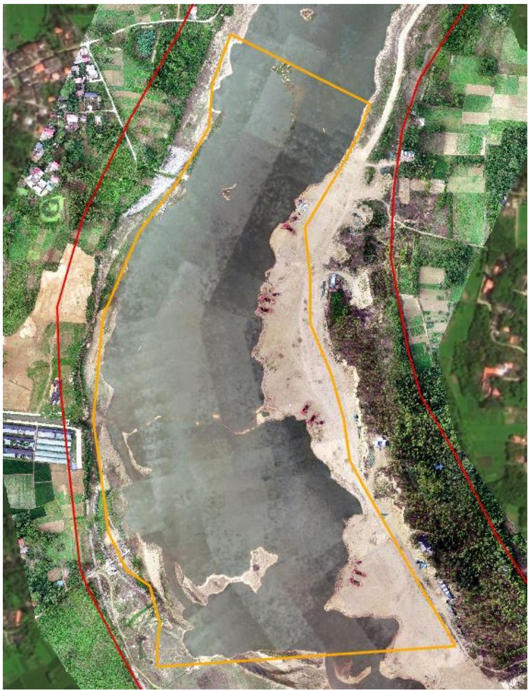
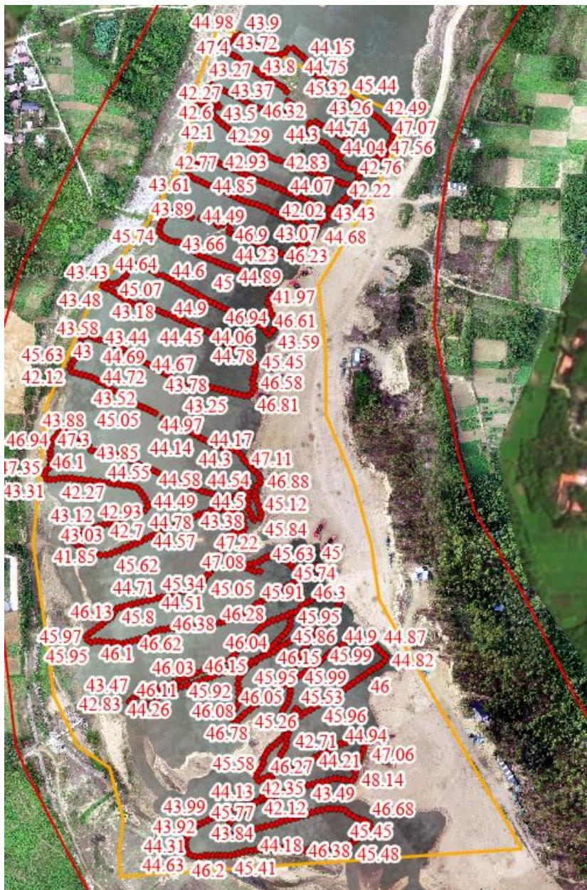

（1）现场监测 通过现场实地查看，商城县灌河 GHK2 金寨村采区主要开采方式为船采，分为多个标段进行开采，砂石均通过船只运送至采区右岸临时堆砂点，开采结束后船只机具集中停靠在采区岸边，现场平整基本到位，无坑洼不平，生态修复情况良好，河道内存在局部孤岛，需进一步提升采砂与工程治理相结合措施。  图 5.8-6 商城县 GHK2 金寨村采区提砂作业码头  图 5.8-7 商城县 GHK2 金寨村采区现场照片 # （2）无人机航测 采砂监管测量人员对豫商城砂许〔2023〕第 01 号采砂区域进行了无人机航空摄影测量，叠加 2023 年度规划批复范围（桩号 $\mathrm { K } 1 5 { + } 2 4 0 \sim$ $\mathrm { K } 1 6 { + } 5 0 0$ ）进行评估分析，未发现超范围开采问题，开采区现场生态修复基本到位。  图 5.8-8 商城县河凤桥乡金寨村开采区无人机正射影像 # （3）无人船水下测量 根据批复文件和 2023 年度实施方案，商城县金寨村采区采后控制高程为 44.63-45.26m。通过无人船单波束声呐测量采区水下地形，测量成果显示采区下游局部深度低于 44.63m ，主要位于提砂作业区附近，存在提砂区修复不到位问题。  序号 河段位置 采区名称 桩号 长度(m) 面积(m²) 年度控制开采高程(m) 年度控制开采量(万m³) 采砂作业方式 采砂船(艘) 提砂船(艘) 挖掘机(辆) 1 灌河上游 正冲采区 K10+150~K10+600 450 2.69 118.65~118.20 6 旱采 2 2 新建坳采区 K17+210~K17+800 590 5.23 104.09~103.50 8 2 3 灌河 大湖沿采区 K6+536~K7+416 880 28.53 51.00~50.56 81 水采 6 3 4 凤凰窝采区 K8+944~K9+264 320 8.99 50.50~50.34 40 3 2 5 金寨采区 K15+240~K16+500 1260 34.20 45.26~44.63 145 10 5  图 5.8-9 商城县灌河金寨村采区开采深度批复文件 图 5.8-10 商城县灌河金寨村采区无人船实测数据
