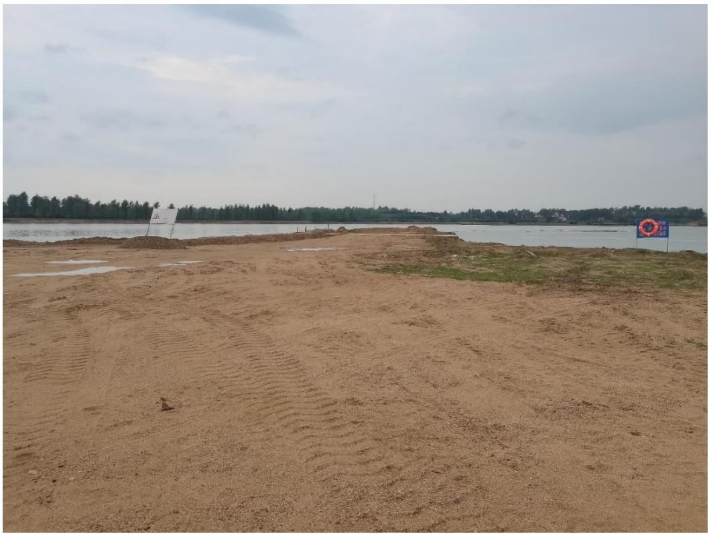
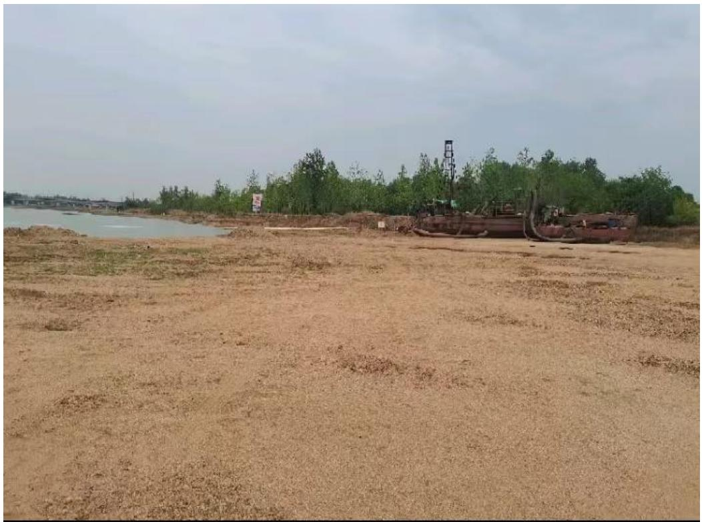
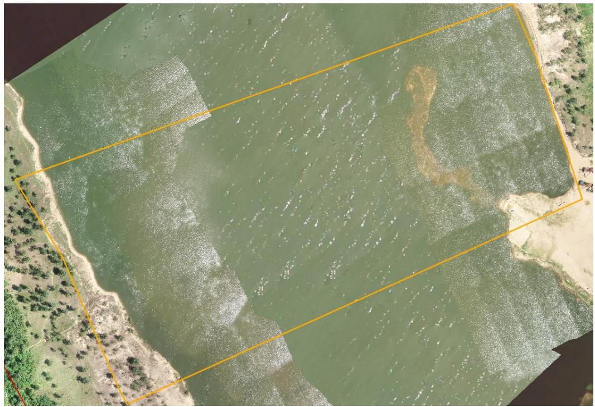
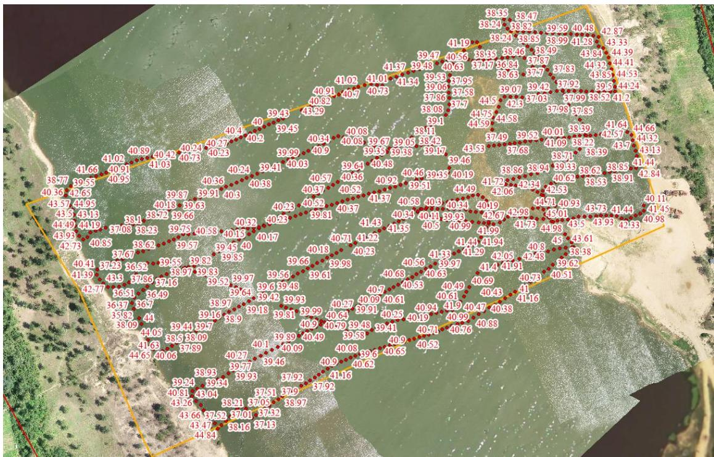

（1）现场监测 通过现场实地查看，商城县灌河 GHK3 鄢岗镇李家楼开采区采砂活动主要位于水下，对河岸环境扰动较小，砂石通过船只运送至采区上游右岸临时堆砂点，开采结束后船只机具已拖离上岸并集中停靠，临时堆砂点现场平整到位，无坑洼不平，生态修复基本到位。   图 5.8-11 商城县灌河李家楼采区现场照片 图 5.8-12 商城县灌河李家楼采区临时堆砂点 # （2）无人机航测 采砂监管测量人员对豫商城砂许〔2023〕第 02 号采砂区域进行了无 人机航空摄影测量，叠加 2023 年度规划批复范围（桩号 K18+935～$\mathrm { K } 1 9 + 2 3 5$ ）进行评估分析，未发现超范围开采问题，开采区现场生态修复基本到位。  图 5.8-13 商城县鄢岗镇李家楼开采区无人机正射影像 # （3）无人船水下测量 根据批复文件和 2023 年度实施方案，商城县李家楼开采区采后控制高程为 43.37-43.52m。通过无人船单波束声呐测量采区水下地形，水下地形高程基本位于 40.3m 左右，测量成果显示 2023 年度批复采区水下高程普遍低于最低控制高程 $( 4 3 . 3 7 \mathrm { m } )$ ，存在超深度开采问题。  序号 河段位置 采区名称 桩号 长度(m) 面积(m²) 年度控制开采高程(m) 年度控制开采量(万m³) 采砂作业方式 采砂船(艘) 提砂船(艘) 挖掘机(辆) 1 灌河上游 正冲采区 K10+150~K10+600 450 2.69 118.65~118.20 6 早采 2 2 新建坳采区 K17+210~K17+800 590 5.23 104.09~103.50 8 2 3 灌河下游 大湖沿采区 K6+536~K7+416 880 28.53 51.00~50.56 81 水采 6 3 4 凤凰窝采区 K8+944~K9+264 320 8.99 50.50~50.34 40 3 2 5 金寨采区 K15+240~K16+500 1260 34.20 45.26~44.63 145 10 5 6 李家楼采区 K18+935~K19+235 300 15.85 43.52~43.37 30 2 1 7 范围孜采区 K22+460~K23+400 940 14.45 40.03~39.56 50 4 2  图 5.8-14 商城县灌河李家楼采区开采深度批复文件 图 5.8-15 商城县灌河李家楼采区无人船实测数据
