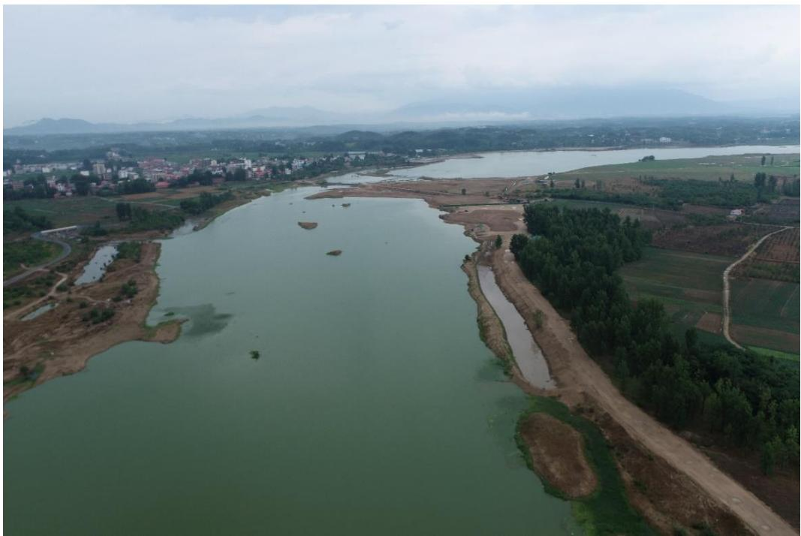
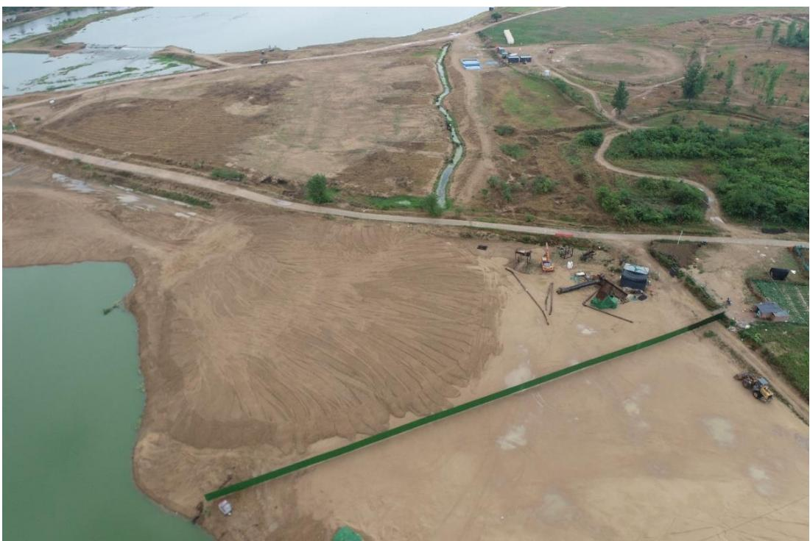
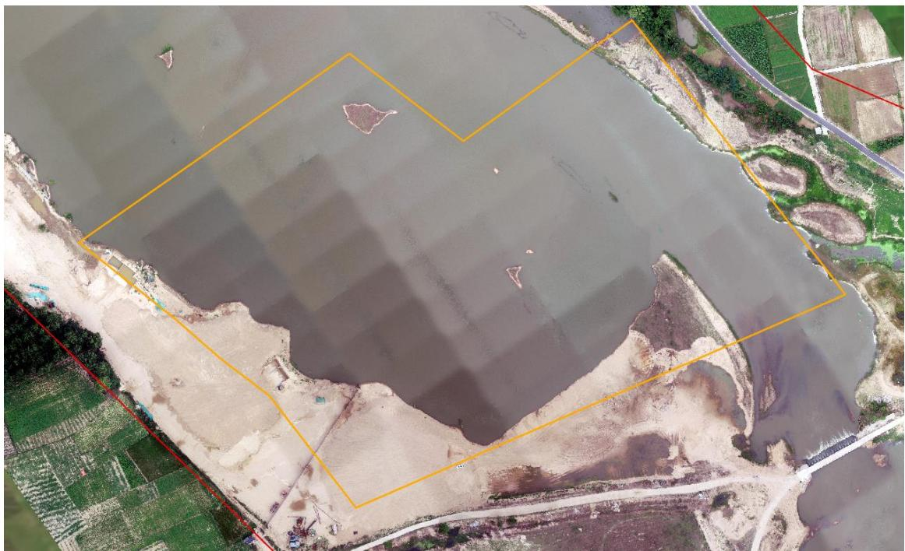
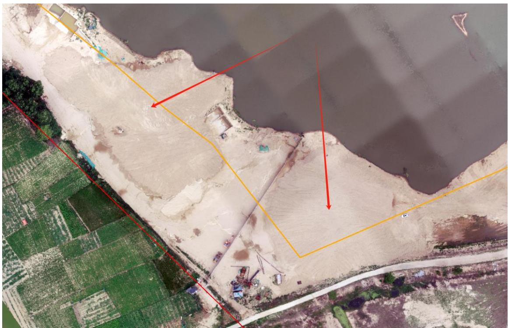
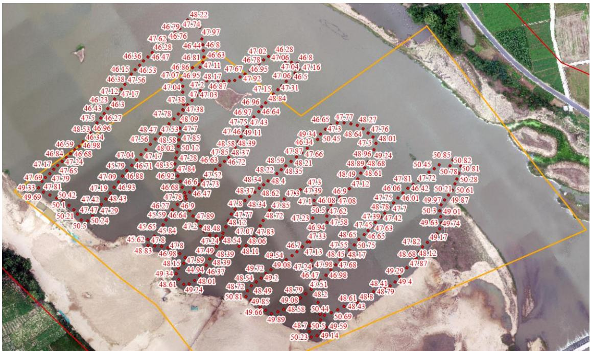

（1）现场监测 通过现场实地查看，商城县灌河 GHK1 凤凰窝采区采砂活动主要位于水下，对河岸环境扰动较小，开采结束后船只已撤离采区并集中停靠在采区下游岸边，采区内存在局部废弃料未清理，部分作业机具未拖离河道管理范围线外。   图 5.8-16 商城县灌河凤凰窝采区无人机照片 图 5.8-17 商城县灌河凤凰窝采区存在废弃料未清理 # （2）无人机航测 采砂监管测量人员对豫商城砂许〔2023〕第 04 号采砂区域进行了无人机航空摄影测量，叠加 2023 年度规划批复范围（桩号 $\mathrm { K } 8 + 9 4 4 \sim \mathrm { K } 9 + 2 6 4 \ .$ ）进行评估分析，未发现超范围开采问题，采区左岸河滩两处临时堆砂未转 运至储砂场，开采区现场生态修复不彻底。  图 5.8-18 商城县凤凰窝开采区无人机正射影像  图 5.8-19 凤凰窝采区左岸两处临时堆砂未转运 # （3）无人船水下测量 根据批复文件和 2023 年度实施方案，商城县凤凰窝采区采后控制高 程为 50.34-50.50m。通过无人船单波束声呐测量采区水下地形，测量成果显示 2023 年度批复采区内大部分区域开采后河底高程低于最低开采控制深度，平均高程为 47.93 米，存在超深度开采问题。  序号 河段位置 采区名称 桩号 长度(m) 面积(m²) 年度控制开采高程(m) 年度控制开采量(万m³) 采砂作业方式 采砂船(艘) 提砂船(艘) 挖掘机(辆) 1 灌河上游 正冲采区 K10+150~K10+600 450 2.69 118.65~118.20 6 早采 2 2 新建坳采区 K17+210~K17+800 590 5.23 104.09~103.50 8 2 3 灌河 大湖沿采区 K6+536~K7+416 880 28.53 51.00~50.56 81 水平 6 3 4 凤凰窝采区 K8+944~K9+264 320 8.99 50.50~50.34 40 3 2 5 金寨采区 K15+240~K16+500 1260 34.20 45.26~44.63 145 10 5  图 5.8-20 商城县灌河凤凰窝采区开采深度批复文件 图 5.8-21 商城县灌河凤凰窝采区无人船实测数据
