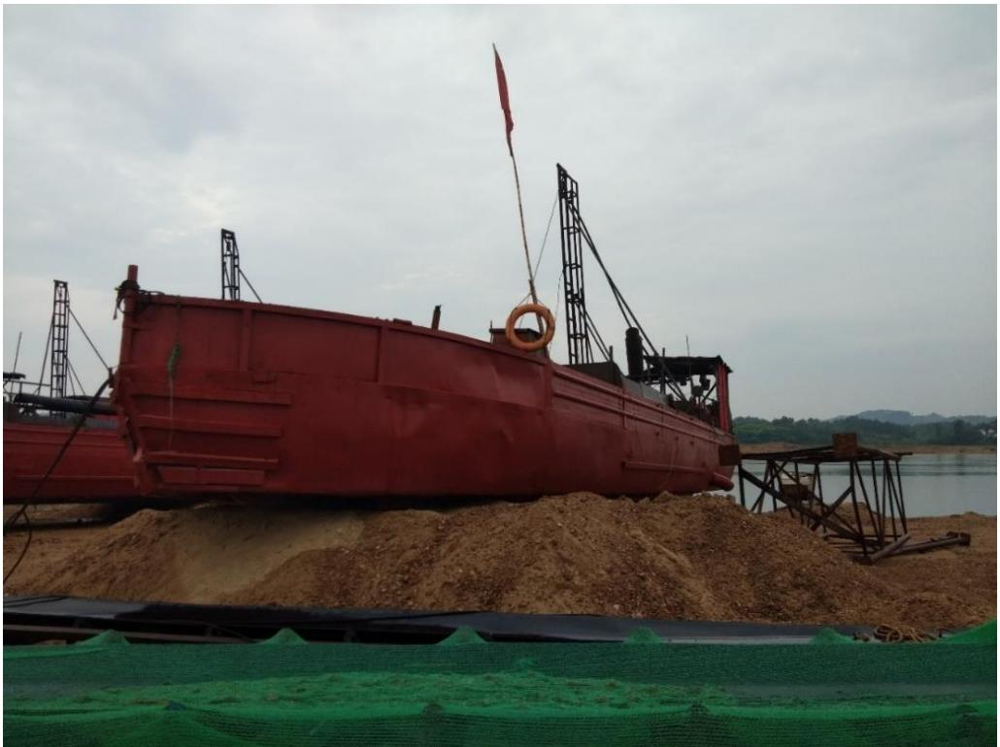
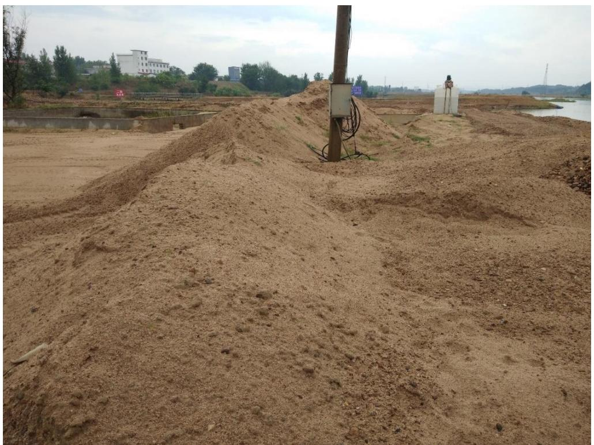
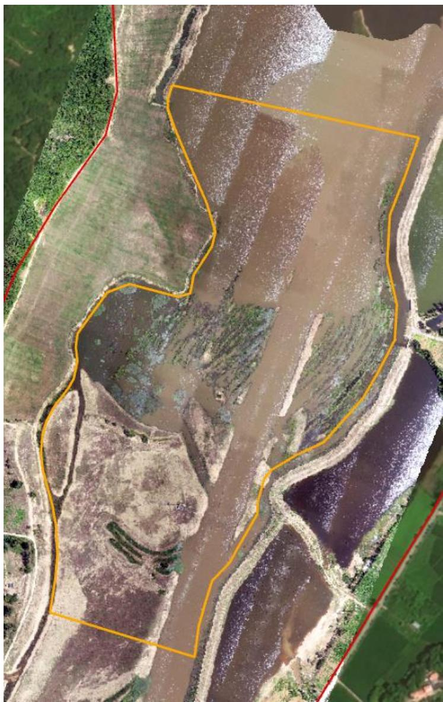
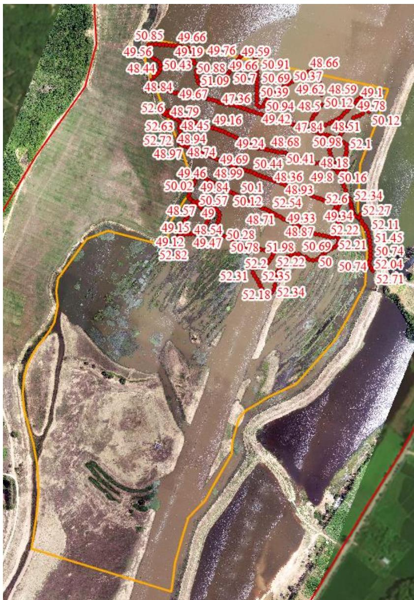

（1）现场监测 通过现场实地查看，商城县灌河 GHK1 大湖沿采区采砂活动主要位于水下，对河岸环境扰动较小，砂石通过船只运送至采区右岸临时堆砂点，开采结束后船只机具已撤离采区并集中停靠，采区整体生态修复基本到位，存在小规模弃料堆积。   图 5.8-22 采区作业机具集中停靠 图 5.8-23 采区小规模堆砂 # （2）无人机航测 采砂监管测量人员对豫商城砂许〔2023〕第 04 号采砂区域进行了无人机航空摄影测量，叠加 2023 年度规划批复范围（桩号 $\mathrm { K } 6 { + } 5 3 6 \sim \mathrm { K } 7 { + } 4 1 6 \ \AA$ ） 进行评估分析，未发现超范围开采问题，开采区现场生态修复基本到位。  图 5.8-24 商城县灌河大湖沿采区无人机正射影像 # （3）无人船水下测量 根据批复文件和 2023 年度实施方案，大湖沿采区采后控制高程为50.56-51.00m。通过无人船单波束声呐测量采区水下地形，测量成果显示局部采区深度低于 50.56m，主要位于提砂区附近，属于提砂区修复不到位。  序号 河段位置 采区名称 桩号 长度(m) 面积(m²) 年度控制开采高程(m) 年度控制开采量(万m³) 采砂作业方式 采砂船(艘) 提砂船(艘) 挖掘机(辆) 1 灌河上游 正冲采区 K10+150~K10+600 450 2.69 118.65~118.20 6 早采 2 2 新建坳采区 K17+210~K17+800 590 5.23 104.09~103.50 8 2 3 大湖沿采区 K6+536~K7+416 880 28.53 51.00~50.56 81 6 3 4 凤凰窝采区 K8+944~K9+264 320 8.99 50.50~50.34 40 3 2  图 5.8-25 商城县灌河大湖沿采区开采深度批复文件 图 5.8-26 商城县灌河大湖沿采区无人船实测数据
