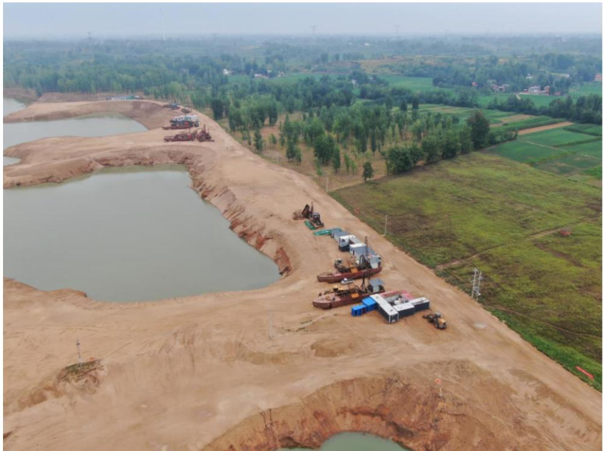
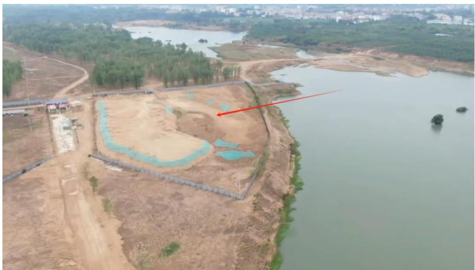
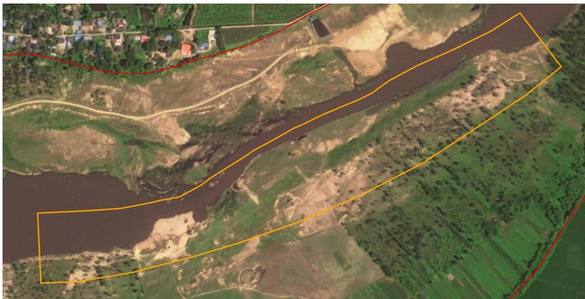
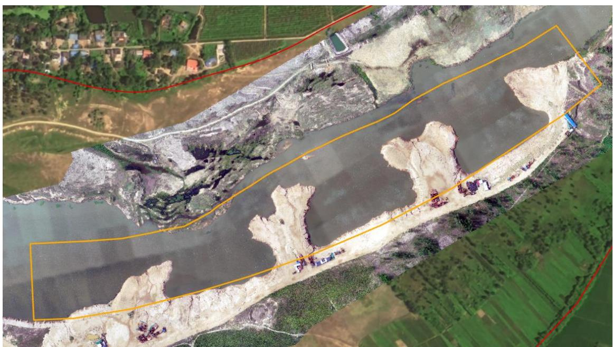
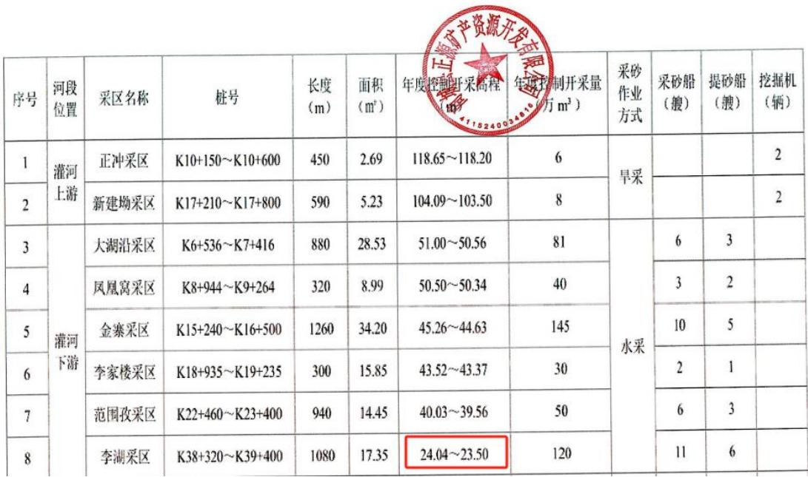
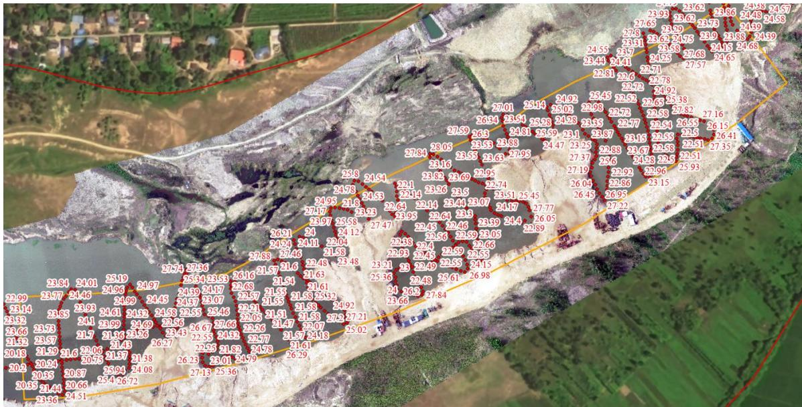

（1）现场监测 通过现场实地查看，商城县灌河 GHK5 李湖采区采砂活动主要位于水下，实时开采作业后岸线参差不平顺，未进行修复；存在阻水砂堆未修复；河道红线范围内存在私人堆砂场，需转运出河道管理范围线外。   图 5.8-27 商城县灌河李湖采区无人机照片 图 5.8-28 商城县灌河李湖采区临时堆砂点 # （2）无人机航测 采砂监管测量人员对豫商城砂许〔2023〕第 05 号采砂区域进行了无人机航空摄影测量，叠加 2023 年度规划批复范围（桩号 $~ \mathrm { K } 3 8 \substack { + 3 2 0 } \sim$ K39+400）进行评估分析，未发现超范围开采问题，作业码头存在水土流失情况，采区生态修复工作不到位。航测影像中发现采区右岸边停靠多艘 废弃采砂船，应当拖离河道管理范围线外停放，避免造成采砂作业机具超出许可批复数量的误判。   （a）开采前 （b）开采后 图 5.8-29 商城县李湖采区无人机正射影像 # （3）无人船水下测量 根据批复文件和 2023 年度实施方案，该采区采后控制高程为 23.50-24.04m 。测量成果显示 2023 年度批复采区局部区域深度低于 23.50m ，主 要位于提砂区附近，属于提砂区修复不到位。   图 5.8-30 商城县灌河李湖开采深度批复文件 图 5.8-31 商城县灌河李湖采区无人船实测数据
