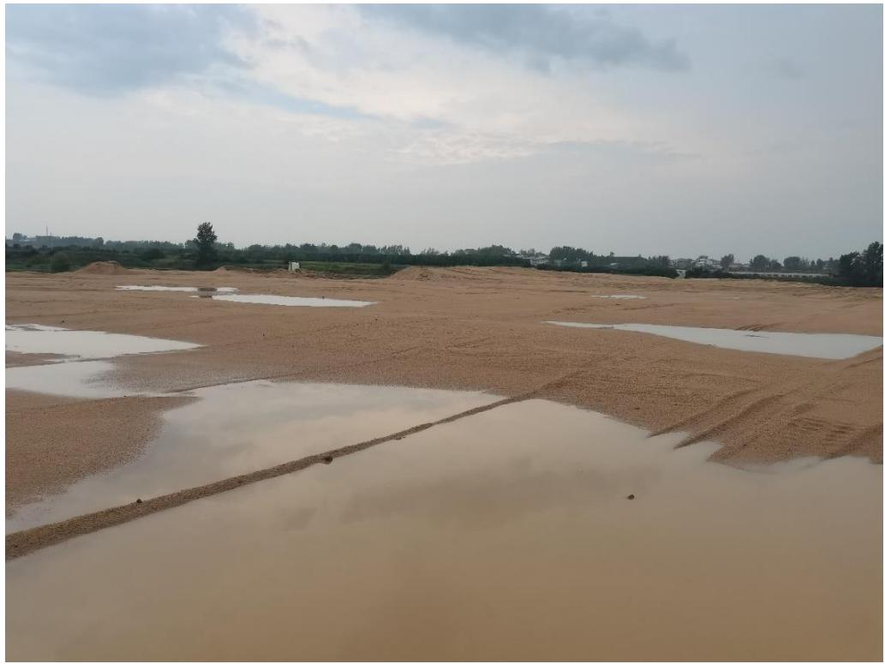
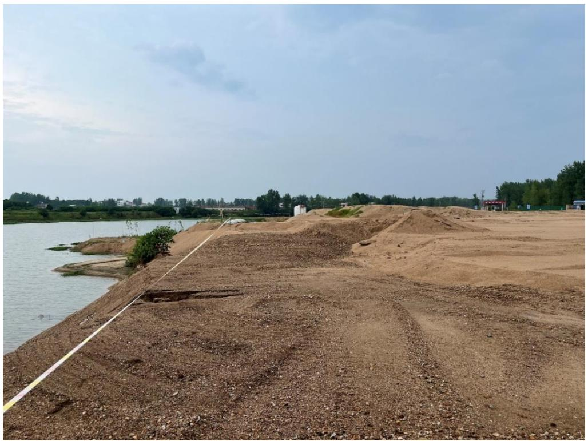
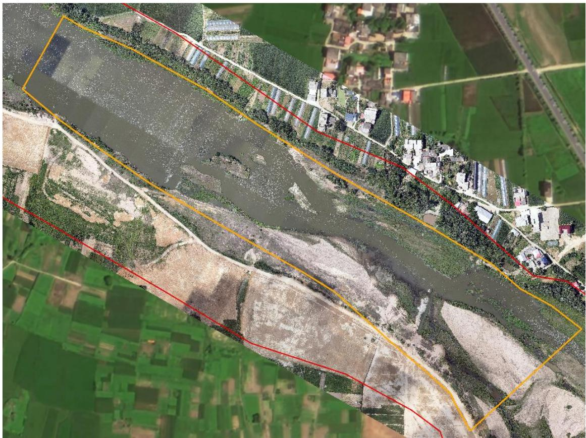
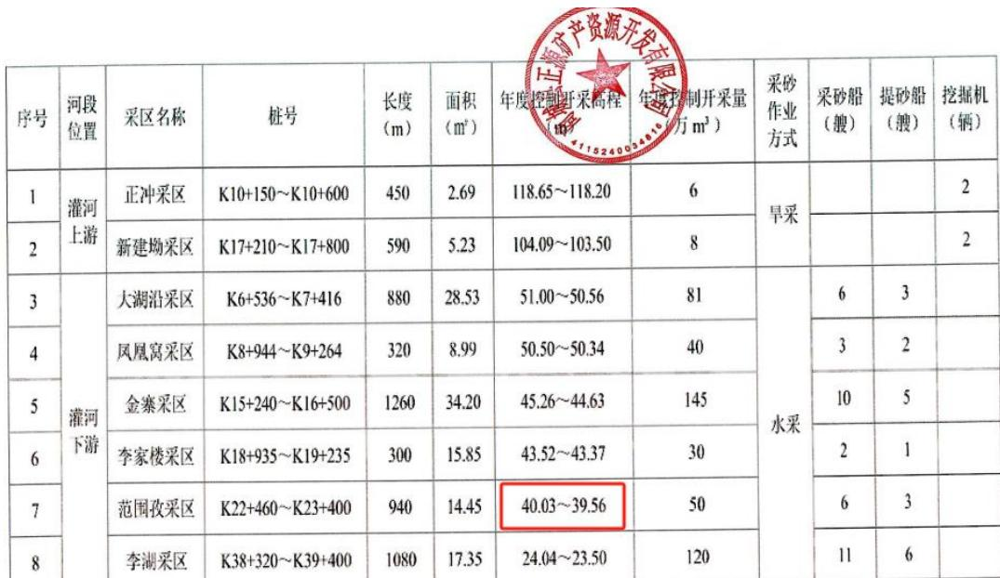
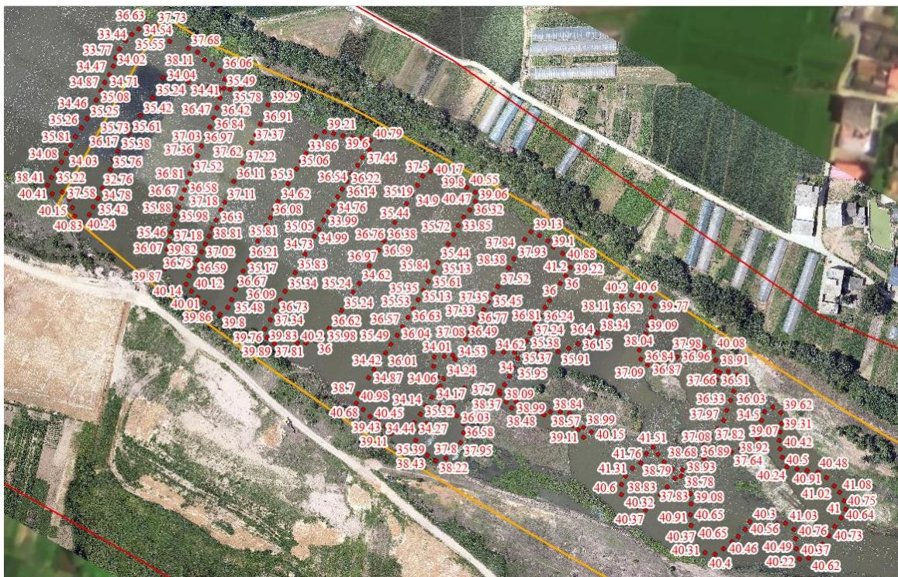

（1）现场监测 通过现场实地查看，商城县灌河 GHK4 范围孜采区采砂活动主要位于水下，对河岸环境扰动较小，砂石通过船只运送至采区右岸临时堆砂点，开采结束后船只机具已撤离采区并集中停靠，采区整体生态修复基本到位，存在小规模弃料堆积。  图 5.8-32 商城县灌河范围孜采区监测现场  图 5.8-33 商城县灌河范围孜提砂码头少量弃料 # （2）无人机航测 采砂监管测量人员对豫商城砂许〔2023〕第 06 号采砂区域进行了无人机航空摄影测量，叠加 2023 年度规划批复范围（桩号 K22+460～ K23+400）进行评估分析，未发现超范围开采问题，开采作业主要位于采区中下游河段，对河道两岸扰动不大，开采区现场生态修复基本到位。  图 5.8-34 商城县范围孜采区无人机正射影像 # （3）无人船水下测量 根据批复文件和 2023 年度实施方案，商城县范围孜采区采后控制高程为 39.56-40.03m。通过无人船单波束声呐测量采区水下地形，测量成果显示已开采区域水下高程普遍低于采后最低控制高程，平均深度为 36.60米，存在超深度开采问题，平均超深约 2.96 米。  图 5.8-35 商城县灌河范围孜采区开采深度批复文件  图 5.8-36 商城县灌河范围孜采区无人船实测数据
