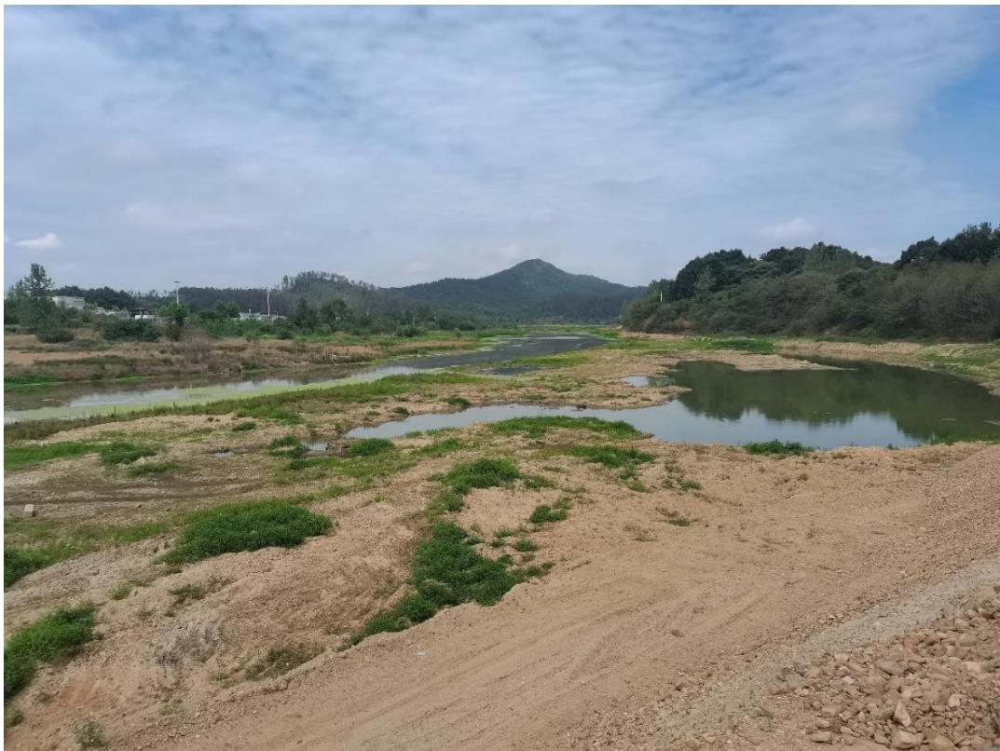
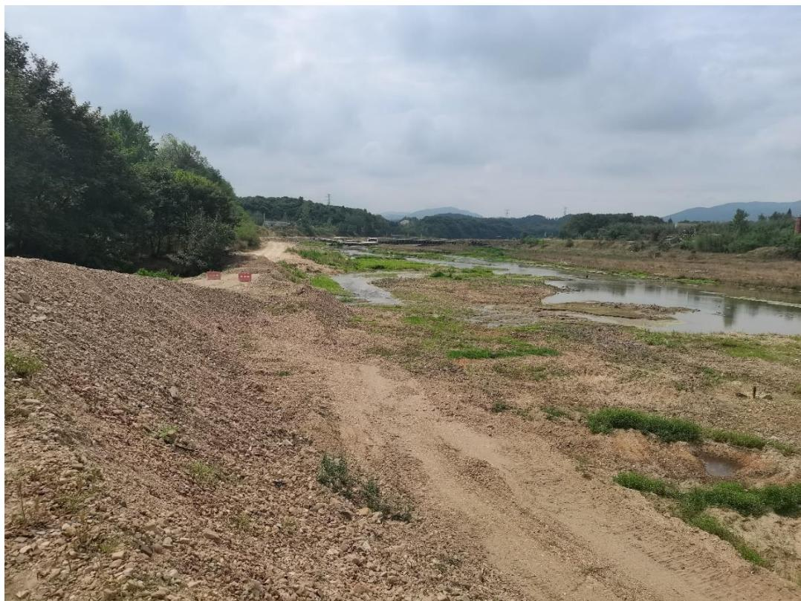
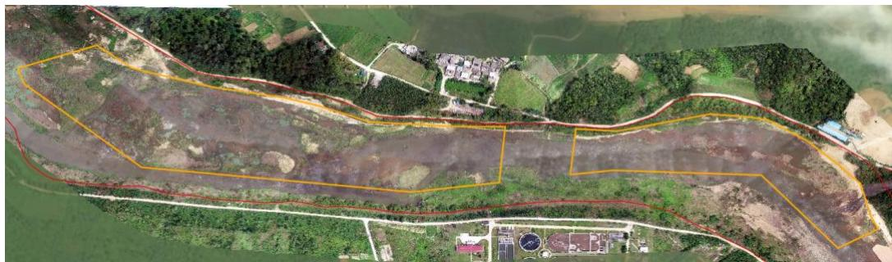
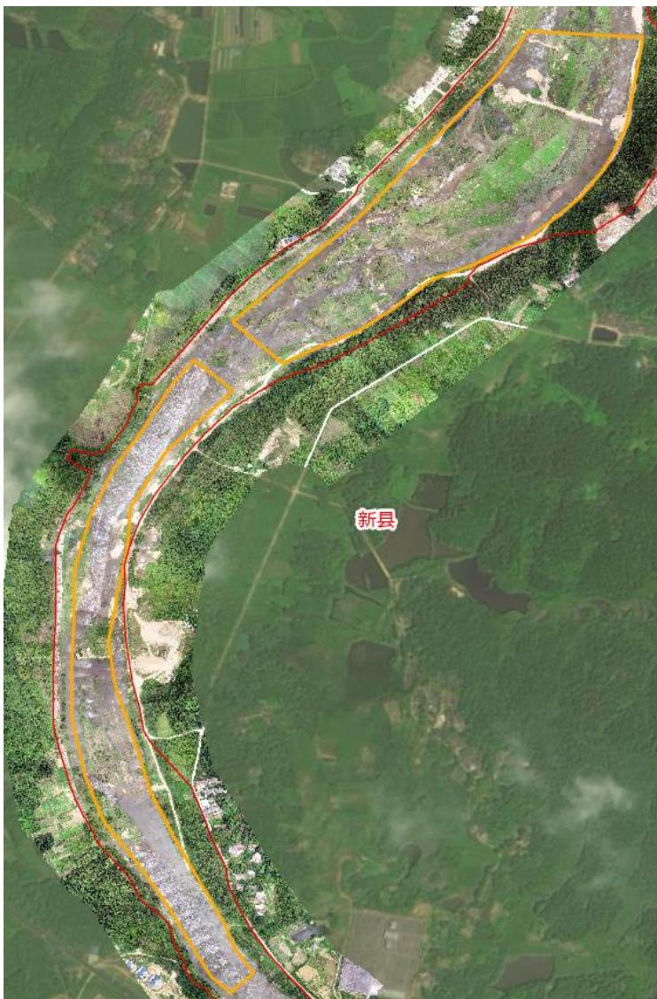

（1）现场监测 经现场监测，现场实际作业范围不大，基本保留了原始河道状况。采区按照规定设置了公示牌、警示牌等，新建储砂场布设在河道管理线外，采用封闭式管理，“六有”规定基本落实到位。考虑到采区实际开采范围有限，且以旱采为主，同时受旱情影响现场河道水位较浅，本次监管未进行无人船水下高程测量。   图 5.9-1 新县浒湾砂场现场照片 图 5.9-2 新县浒湾砂场现场照片 # （2）无人机航测 采砂监管测量人员对新县潢河浒湾乡游围孜村 HH-1~HH-4可采区进 行了无人机航空摄影测量，叠加 2023 年度批复范围（桩号 $\mathrm { K } 1 0 6 { + } 2 0 0 { \cdot }$ K106+950、K107+050-K107+580、K108+100-K108+950 以及 $\mathrm { K } 1 0 9 + 0 5 0 -$ K110+400）评估分析，现场作业以旱采为主，对河道扰动不大，总体来看，采区生态修复工作基本到位。从影像上看，未发现有超范围开采情况。   图 5.9-3 新县2023 年度采区下游无人机正射影像 图 5.9-4 新县2023 年度采区上游无人机正射影像
