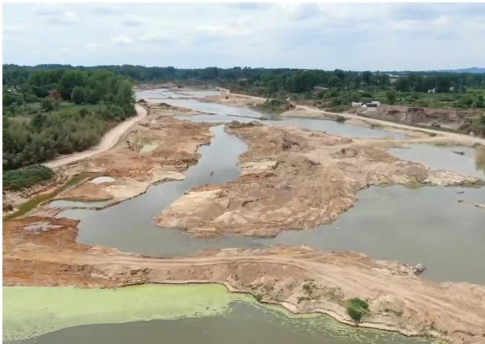
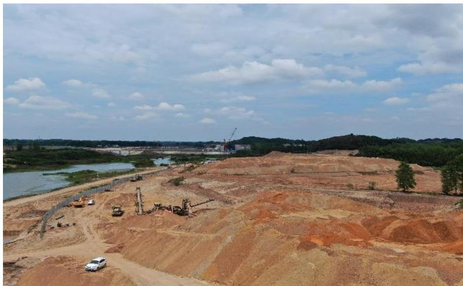
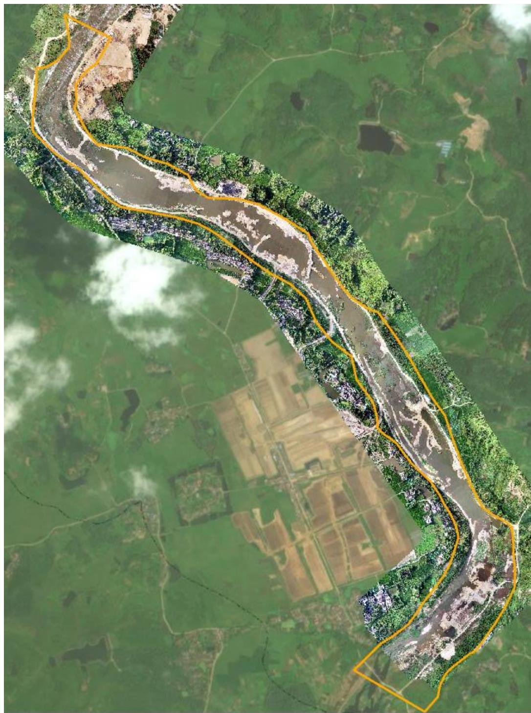
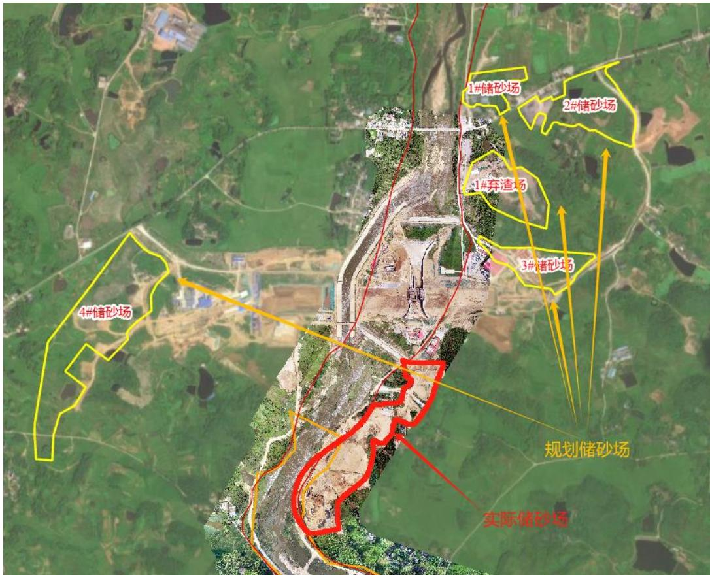
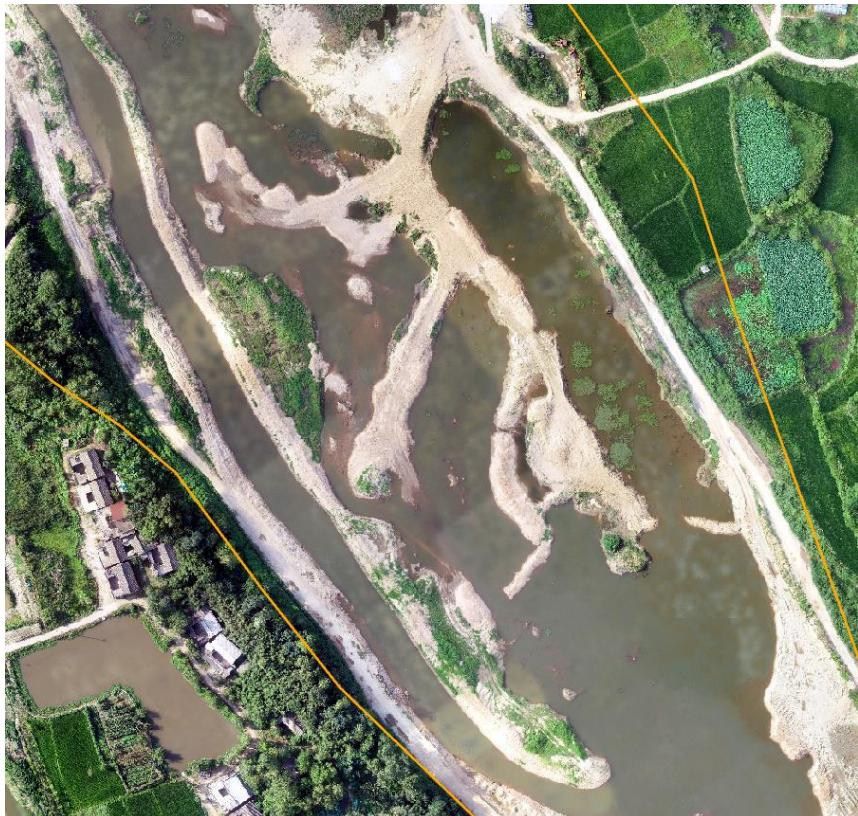
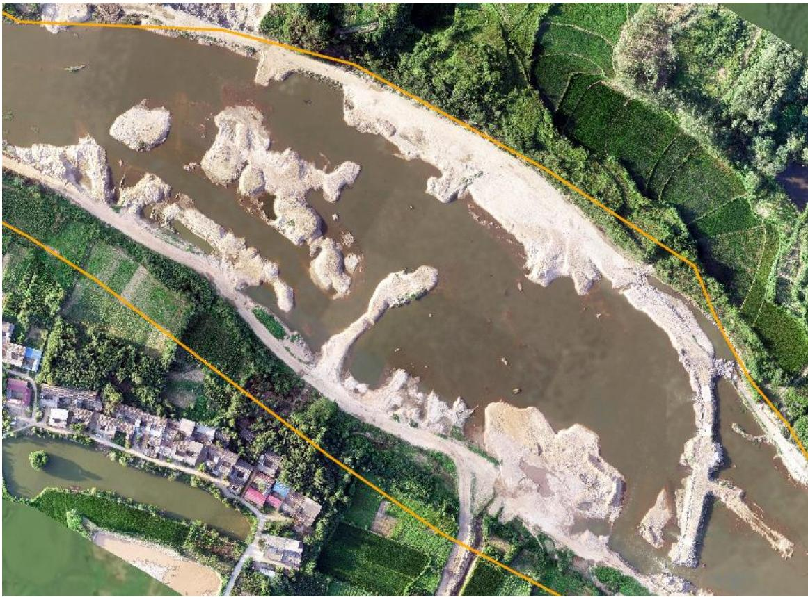

（1）现场监测 通过实地查看，光山县袁湾水库库底疏浚工程河道内存在大面积连片堆砂，高度超过四米。河道疏浚现场不规范作业，现场河道内河床存在大面积坑洼不平，废弃料未及时清理。疏浚现场主河道内存在筛砂制砂机具； 河道内存在停车场及管理房屋，作业机械未及时撤离河道。批复储砂场内堆砂高度过高，存在安全隐患，且无防尘覆盖措施。疏浚现场公示牌、警示牌严重缺失，作业边界未设立识别牌。   图 5.10-1河道内存在大面积坑挖不平废弃料未及时清理 图 5.10-2疏浚现场存在筛砂制砂机具 # （2）无人机航测 采砂监管测量人员对光山县袁湾水库库底特殊清理工程进行无人机 航空摄影测量并叠加砂石处置方案中批复的工程范围及储砂场范围，经评估分析，未发现存在超范围开采问题，未按照方案设计的位置布设储砂场，现场坑洼不平，岸线不平顺，生态修复不到位。  图 5.10-3 无人机正射影像   图 5.10-4 实际储砂区域与规划方案不一致 图 5.10-5 疏浚工程上游局部无人机正射影像  图 5.10-6 疏浚工程中游局部无人机正射影像
