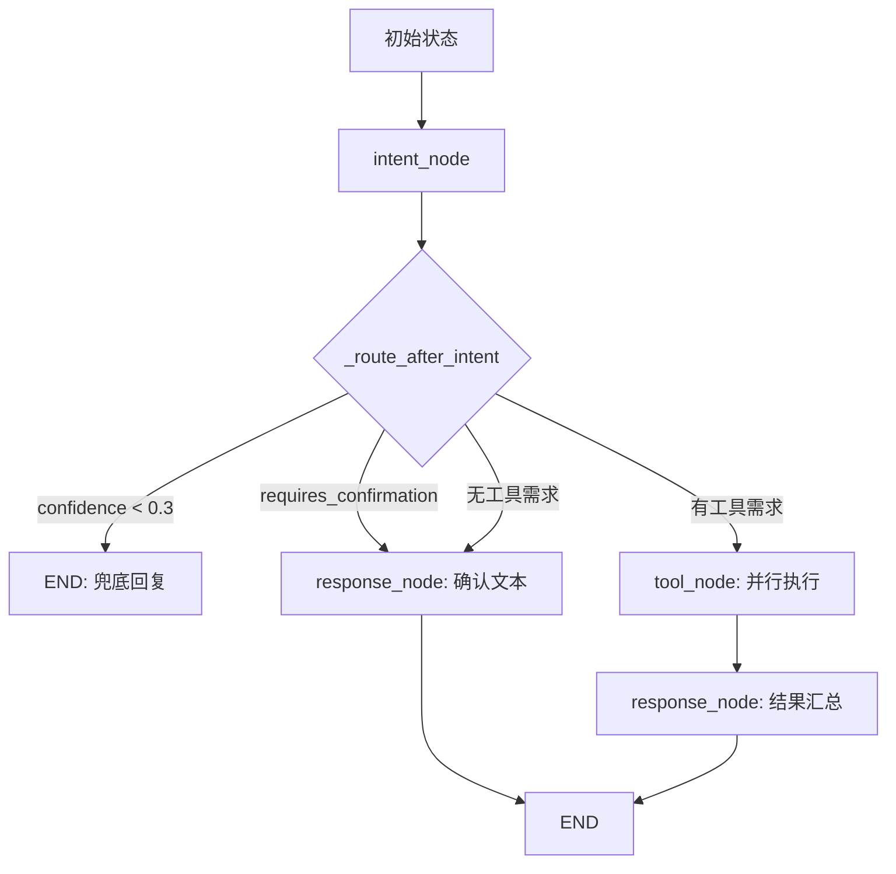

# map_assistant_v1 智能体架构设计文档

> 编写日期：2026-06-10 | 版本：v1.0

---

## 一、架构总览

项目采用 **LangGraph 多智能体编排架构**，替代了早期基于 Qwen Agent Assistant 的单体 Agent 模式。核心设计理念：**意图识别 → 工具编排 → 结果汇总** 三阶段流水线。

```
┌─────────────────────────────────────────────────────────┐
│                    main.py /chat /chat/stream            │
│   USE_INTENT_AGENT=true → LangGraph 管道（当前默认）       │
│   USE_INTENT_AGENT=false → 旧 Qwen Assistant 降级通道     │
└────────────────────────┬────────────────────────────────┘
                         │
                         ▼
┌─────────────────────────────────────────────────────────┐
│              TaskExecutor (LangGraph 编排器)               │
│                                                          │
│  ┌──────────────┐    ┌──────────────┐   ┌─────────────┐  │
│  │ intent_node  │───▶│  tool_node   │──▶│response_node│  │
│  │ 意图识别+规划  │    │  并行工具调用   │   │  结果汇总输出  │  │
│  └──────────────┘    └──────────────┘   └─────────────┘  │
│         │                   │                   │         │
│    IntentAgent        QwenToolAdapter        LLM汇总      │
│  (LangChain 0.1°)   (11 工具适配器)      (ChatOpenAI)     │
└─────────────────────────────────────────────────────────┘
```

### 关键文件索引

| 文件 | 角色 | 行数 |
|------|------|------|
| `backend/agents/intent_types.py` | 数据模型：IntentType 枚举、IntentResult、TaskStep | 93 |
| `backend/agents/intent_agent.py` | 意图分类引擎，LangChain `with_structured_output` | 226 |
| `backend/agents/task_executor.py` | LangGraph 图编排 + 3 节点 + 条件路由 | 1090 |
| `backend/prompts.py` | 提示词 SSoT 统一管理 | 269 |
| `backend/main.py` | FastAPI 入口，双模式路由 /chat、/chat/stream | 4291 |

---

## 二、数据模型

### 2.1 意图枚举 (IntentType)

系统支持 **10 种意图类型**：

| 意图 | 枚举值 | 对应工具 | 说明 |
|------|--------|---------|------|
| 地图展示 | `map_display` | map_tool / cesium_tool | 加载矢量、切换底图、标记管理 |
| 数据查询 | `data_query` | postgresql_tool | SQL 查询、统计、schema 获取 |
| 知识检索 | `knowledge_search` | knowledge_base_tool | RAGFlow 政策/文档检索 |
| 数据可视化 | `data_visualization` | data_visualizer_tool | SQL→ECharts 图表生成 |
| 报告生成 | `report_generation` | report_generator_tool | 模板渲染 + Word 导出 |
| 天气查询 | `weather_query` | weather_tool | 实时天气与预报 |
| 位置搜索 | `location_search` | location_search | 地名→经纬度 |
| 坐标标注 | `coordinate_marker` | coordinate_marker | 地图打点标注 |
| 空间处理 | `spatial_processing` | spatial_processing_tool | 坐标转换/矢量生成 |
| 跨意图复合 | `cross_intent` | 多工具组合 | 多步骤复杂任务 |

### 2.2 意图结果 (IntentResult)

```python
class IntentResult(BaseModel):
    primary_intent: IntentType       # 主意图
    confidence: float                # 置信度 0.0-1.0
    entities: List[str]              # 提取实体（地名、表名）
    task_context: str                # 任务上下文摘要
    execution_plan: List[TaskStep]   # 执行计划
    requires_confirmation: bool      # 是否需要用户确认
    suggestions: List[str]           # 补充建议
```

### 2.3 任务步骤 (TaskStep)

```python
class TaskStep(BaseModel):
    step_id: int          # 步骤序号 (从1开始)
    action: str           # 执行动作描述
    tool: Optional[str]   # 工具名称，严禁为空
    params: dict          # 工具参数
    reasoning: str        # 推理过程
    expected_output: str  # 期望输出
```

---

## 三、核心组件详解

### 3.1 IntentAgent — 意图识别引擎

**位置**：[`backend/agents/intent_agent.py`](backend/agents/intent_agent.py)

**技术栈**：LangChain `ChatOpenAI` + `with_structured_output(IntentResult)`

**LLM 配置**：
- 模型：`qwen-flash-2025-07-28`（阿里云 DashScope）
- API：`https://dashscope.aliyuncs.com/compatible-mode/v1`
- 参数：temperature=0.1，`enable_thinking=False`

**核心能力**：
1. **结构化输出**：利用 Pydantic 约束直接产出 `IntentResult`，无需手动解析 JSON
2. **DB Schema 动态注入**：首次调用时通过 `SchemaManager` 获取 `ceshen` 表结构，注入 system prompt，确保 SQL 生成准确
3. **历史感知**：取最近 6 轮对话作为上下文
4. **工具参数约束**：在 system prompt 中详尽描述每种工具的合法参数格式，防止幻觉参数

**降级策略**：分析失败时返回 `IntentType.UNKNOWN` + `confidence=0.0` + `requires_confirmation=True`

### 3.2 QwenToolAdapter — 工具适配器

**位置**：[`backend/agents/task_executor.py`](backend/agents/task_executor.py#L39)

将 Qwen Agent 的 `BaseTool` 实例包装为统一接口：

```python
class QwenToolAdapter:
    tool: BaseTool       # 原始工具实例
    name: str            # 工具名称

    def invoke(self, params: dict) -> dict:
        result = self.tool.call(params)
        # 统一返回 {"tool_name": ..., "result": {...}}
```

**懒加载**：工具实例在首次调用时才创建，避免启动时全部初始化。

### 3.3 TaskExecutor — LangGraph 编排器

**位置**：[`backend/agents/task_executor.py`](backend/agents/task_executor.py)

#### 3.3.1 LangGraph 图结构



#### 3.3.2 AgentState 共享状态

```python
class AgentState(TypedDict):
    user_message: str
    chat_history: List[Dict]
    intent_result: Optional[IntentResult]    # intent_node 产出
    tool_results: List[Dict]                 # tool_node 产出 (Annotated, operator.add)
    response: str                            # response_node 产出
    map_commands: List[Dict]                 # 2D 地图命令 (Annotated, operator.add)
    cesium_commands: List[Dict]              # 3D 地图命令 (Annotated, operator.add)
    charts: List[Dict]                       # 图表配置 (Annotated, operator.add)
    report_url: Optional[str]                # 报告下载地址
    error: Optional[str]                     # 错误信息
```

**关键设计**：`Annotated[List, operator.add]` 使得多个并行工具的结果自动合并到同一列表中。

#### 3.3.3 三大节点详解

**① intent_node** — 调用 `IntentAgent.analyze()` 产出 `IntentResult`

**② tool_node** — 核心编排逻辑：
- **分离报告工具**：`report_generator_tool` 单独提取，等前置工具（DB查询/可视化）完成后执行
- **并行执行**：非报告工具全部 `asyncio.gather` 并行调用
- **数据充分性检查**：执行报告生成前调用 `check_data_sufficiency()`，数据不足则自动跳过
- **参数规范化**：`_normalize_tool_params()` 补全缺失的必需参数（如 postgresql_tool 的 `operation`）

**③ response_node** — 结果汇总：
- 从 `tool_results` 提取 `map_commands` / `cesium_commands` / `charts` / `report_url`
- **智能透传优化**：如果工具（如 `data_visualizer_tool`）已产出高质量 Markdown 摘要，跳过 LLM 二次汇总
- **兜底保护**：地图意图但无工具结果时不调用 LLM 空想，返回明确提示

#### 3.3.4 条件路由逻辑

```python
def _route_after_intent(state):
    intent = state.intent_result
    if intent.confidence < 0.3:    → END (兜底回复)
    if intent.requires_confirmation: → response_node (确认文本)
    if not required_tools:          → response_node (直接回答)
    if required_tools:              → tool_node (执行工具)
```

#### 3.3.5 双模式执行接口

| 方法 | 用途 | 特点 |
|------|------|------|
| `execute()` | 非流式 `/chat` | 调用 `graph.ainvoke()`，返回完整字典 |
| `execute_stream()` | SSE 流式 `/chat/stream` | 手动管理节点，每个阶段 yield 进度事件 |

流式模式产出的事件类型：
- `status` — 阶段进度（start / intent_start / tool_plan / response / done）
- `intent` — 意图识别结果 + 执行计划
- `plan` — 执行计划详情
- `tool_start` / `tool_result` — 每个工具步骤的开始和结果
- `final` — 最终汇总结果

---

## 四、工具体系

### 4.1 工具全景（11 个已注册工具）

| # | 工具名称 | 文件 | 功能 |
|---|---------|------|------|
| 1 | `map_tool` | tools/map_tool.py | 2D Leaflet：矢量加载、底图切换、标记、视图跳转 |
| 2 | `cesium_tool` | tools/cesium_tool.py | 3D Cesium：飞行、GeoJSON 图层、底图、标记 |
| 3 | `postgresql_tool` | tools/postgresql_tool.py | PostgreSQL 查询 + schema 获取 + 数据缓存 |
| 4 | `knowledge_base_tool` | tools/ragflow_knowledge_tool.py | RAGFlow 知识库检索 |
| 5 | `data_visualizer_tool` | tools/data_visualizer_tool.py | 自然语言→SQL→ECharts 图表 |
| 6 | `report_generator_tool` | tools/report_generator_tool.py | Word 报告模板渲染 |
| 7 | `weather_tool` | tools/weather_tool.py | 天气查询 |
| 8 | `location_search` | tools/map_tool.py | 地名→坐标搜索 |
| 9 | `coordinate_marker` | tools/map_tool.py | 地图打点 |
| 10 | `spatial_processing_tool` | tools/spatial_processing_tool.py | 坐标投影转换 + 矢量生成 |
| 11 | `mcp_postgres_tool` | tools/mcp_postgres_tool.py | 只读数据库 MCP 工具 |

### 4.2 工具-意图映射

```python
TOOL_INTENT_MAPPING = {
    "map_tool":    → map_display, location_search, coordinate_marker
    "cesium_tool": → map_display
    "postgresql_tool":      → data_query
    "knowledge_base_tool":  → knowledge_search
    "data_visualizer_tool": → data_visualization
    "report_generator_tool": → report_generation
    "weather_tool":          → weather_query
    "spatial_processing_tool": → spatial_processing
}
```

---

## 五、提示词治理体系

**位置**：[`backend/prompts.py`](backend/prompts.py)

采用 **SSoT（单一来源）** 原则，所有提示词集中管理：

```
BUSINESS_RULES       → 高程判定业务规则
TOOL_ROUTING_RULES   → 工具路由规则
OUTPUT_FORMAT_RULES  → 输出格式规范
FORBIDDEN_ACTIONS    → 禁止行为清单
_LEAFLET_VIEW_PROMPT / _CESIUM_VIEW_PROMPT  → 视图自适应路由
INTENT_EXECUTOR_PROMPTS → 按意图类型的专属提示词字典
```

**关键构建函数**：

| 函数 | 用途 |
|------|------|
| `build_main_system_prompt()` | 主 Agent system 提示词 |
| `build_view_system_message(view)` | 根据前端视图(2D/3D)动态注入，防止跨视图工具误调 |
| `build_elevation_injection()` | 高程规则片段，追加到用户消息末尾 |
| `build_intent_classifier_prompt()` | IntentAgent 的 system 提示词 |

### 视图感知路由

系统根据前端当前视图动态注入 system message：

- **2D Leaflet 视图** → 仅允许 `map_tool`、`location_search`、`postgresql_tool`，禁用 `cesium_tool`
- **Cesium 3D 视图** → 仅允许 `cesium_tool`、`location_search`，禁用 `map_tool`

---

## 六、状态管理与会话持久化

### 6.1 LangGraph MemorySaver

- 使用 `MemorySaver` 进程内存储，操作延迟 < 1ms
- 按 `thread_id` 隔离会话
- `graph.ainvoke(state, config={"configurable": {"thread_id": thread_id}})`

### 6.2 SQLite 会话存储

`main.py` 中额外维护 SQLite 会话表，用于：
- 跨服务重启的会话恢复
- 对话历史持久化
- `_persist_chat(thread_id, user_msg, assistant_msg)`

### 6.3 报告 URL 透传

`report_url` 在 `AgentState` 中作为独立字段传递，不在 LLM 消息中编码，避免了 SSE 流式响应中的 URL 丢失问题。

---

## 七、架构亮点

1. **意图-工具解耦**：意图分类与工具执行完全分离，各自独立可测
2. **并行工具调用**：非依赖工具 `asyncio.gather` 并行执行，显著降低延迟
3. **报告智能跳过**：`check_data_sufficiency()` 检查数据充分性，不足时自动跳过报告生成
4. **结果智能透传**：工具已产高质量 Markdown 时跳过 LLM 二次汇总，节省 Token
5. **视图感知路由**：2D/3D 地图各自绑定专属工具，防止跨视图误调用
6. **提示词 SSoT**：所有提示词集中管理，避免分散内联导致的版本漂移
7. **SSE 流式进度**：前端可实时看到"意图分析 → 工具执行 → 总结"全流程
8. **参数自动补全**：`_normalize_tool_params()` 自动补全 LLM 遗漏的必需参数
9. **双模式兼容**：`USE_INTENT_AGENT` 环境变量控制 LangGraph / Qwen Assistant 模式切换
10. **优雅降级**：工具创建失败、意图识别失败、LLM 汇总失败均有兜底回复

---

## 八、数据流全景

```
用户输入 "加载种子场可采区到地图"
         │
         ▼
   intent_node (IntentAgent)
   产出: IntentResult(
     primary_intent=map_display,
     execution_plan=[
       TaskStep(step_id=1, tool="map_tool",
         params={action: "load_vector_layer", table_name: "ceshen",
                 filter: '"Mineable_Area_Name"='种子场可采区''})
     ])
         │
         ▼
   tool_node (并行执行)
   QwenToolAdapter(map_tool).invoke(params)
   → {tool_name: "map_tool", result: {success: true, map_command: {...}}}
         │
         ▼
   response_node
   提取: map_commands=[{type: "load_vector_layer", ...}]
   生成: response="种子场可采区数据已成功加载到地图。"
         │
         ▼
   前端: 收到 response 文本 + map_commands 执行地图操作
```

---

## 九、部署与运行

### 9.1 PM2 进程管理

```bash
# 配置文件
backend/ecosystem.config.js

# 启动/重启
pm2 start ecosystem.config.js
pm2 restart map-assistant-backend map-assistant-frontend
```

### 9.2 服务端口

| 服务 | 端口 | 技术 |
|------|------|------|
| 后端 API | 8006 | FastAPI + Uvicorn |
| 前端 Dev | 3004 | React (react-scripts) |
| GeoServer | Docker | 2.26.2 |
| PostgreSQL | 5432 | PostGIS |

### 9.3 环境变量

| 变量 | 说明 | 默认值 |
|------|------|--------|
| `USE_INTENT_AGENT` | 启用 LangGraph 模式 | `true` |
| `CUDA_VISIBLE_DEVICES` | GPU 设备 | `0` |
| `HF_ENDPOINT` | HuggingFace 镜像 | `https://hf-mirror.com` |
| `DASHSCOPE_API_KEY` | 阿里云 DashScope API Key | (必填) |
